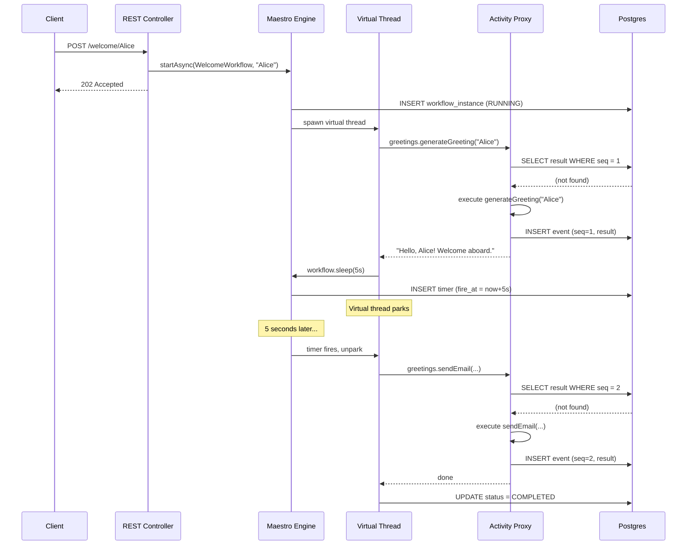
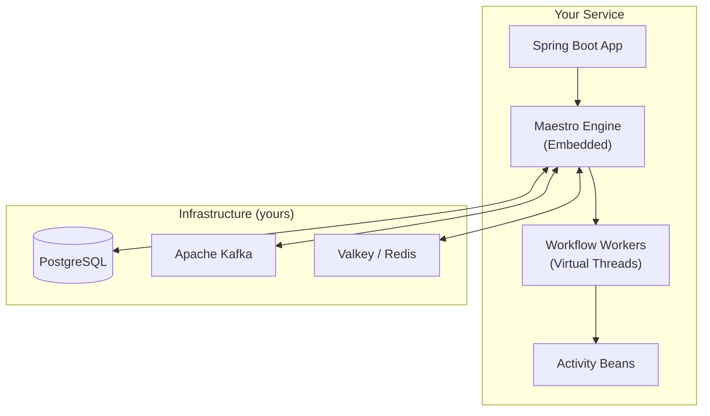

# Maestro

[](LICENSE)
[](https://openjdk.org/projects/jdk/25/)
[](https://spring.io/projects/spring-boot)

**Embeddable durable workflow engine for Spring Boot.** Add a starter to your microservice and get Temporal-grade workflow durability using your existing Postgres, Kafka, and Valkey infrastructure.

---

## What is Maestro?

Maestro is an open-source durable workflow engine delivered as a Spring Boot Starter. It brings crash-recoverable, long-running workflow orchestration to Java microservices **without a central server**. Workflows are plain Java methods. Activities are Spring beans. State is persisted to Postgres. Coordination happens via Kafka and Valkey.

### Why Maestro?

| Solution | Trade-off |
|---|---|
| **Temporal / Cadence** | Powerful, but requires a separate cluster (Cassandra, Elasticsearch, multiple server roles) |
| **Netflix Conductor** | Central server, Elasticsearch dependency, limited Spring Boot integration |
| **Camunda / Zeebe** | BPMN-oriented, requires visual designer; Zeebe needs its own broker |
| **Axon Framework** | Event sourcing focused, steep learning curve, commercial licensing |
| **Maestro** | **Embedded in your service. Uses your Postgres, Kafka, and Valkey. Nothing new to deploy.** |

---

## Key Features

- **Durable Workflows** -- Write workflows as plain Java methods. If the JVM crashes, the workflow resumes from the last completed step on restart.
- **Activity Memoization** -- Activity results are persisted. On recovery, completed steps return stored results instantly -- no re-execution, no duplicate side effects.
- **Signals & Self-Recovery** -- Signals are persisted immediately to Postgres. Whether the signal arrives before, during, or after a workflow reaches its await point -- it is never lost.
- **Saga Compensation** -- Declare compensating actions on activities. On failure, Maestro unwinds the compensation stack in reverse order automatically.
- **Parallel Execution** -- Execute multiple activities or awaits concurrently on virtual threads. Each branch is independently memoized.
- **Durable Timers** -- `workflow.sleep(Duration.ofDays(30))` creates a persistent timer. The service doesn't need to stay alive.
- **Queries** -- Read live workflow state without affecting execution.
- **Durable Retries** -- Activities retry with exponential backoff. Retries survive JVM restarts.
- **Admin Dashboard** -- Standalone monitoring UI with workflow list, event timelines, signal monitor, and one-click retry.
- **Testing Library** -- `maestro-test` provides an in-memory engine with controllable time. No infrastructure required.

---

## Quick Start

### 1. Add dependencies

```kotlin
// build.gradle.kts
dependencies {
    implementation("io.maestro:maestro-spring-boot-starter")
    implementation("io.maestro:maestro-store-postgres")
    implementation("io.maestro:maestro-messaging-kafka")
    implementation("io.maestro:maestro-lock-valkey")

    testImplementation("io.maestro:maestro-test")
}
```

### 2. Define an activity

```java
@Activity
public interface GreetingActivities {
    String generateGreeting(String name);
    void sendEmail(String to, String body);
}
```

### 3. Write a workflow

```java
@DurableWorkflow(name = "welcome", taskQueue = "default")
public class WelcomeWorkflow {

    @ActivityStub(startToCloseTimeout = "PT30S",
                  retryPolicy = @RetryPolicy(maxAttempts = 3))
    private GreetingActivities greetings;

    @WorkflowMethod
    public String welcome(String customerName) {
        var workflow = WorkflowContext.current();

        // Step 1: Generate greeting (memoized -- survives crashes)
        String greeting = greetings.generateGreeting(customerName);

        // Step 2: Wait 5 seconds (durable timer -- survives restarts)
        workflow.sleep(Duration.ofSeconds(5));

        // Step 3: Send email (memoized)
        greetings.sendEmail(customerName + "@example.com", greeting);

        return greeting;
    }
}
```

### 4. Start it from a REST endpoint

```java
@RestController
public class WelcomeController {

    private final MaestroClient maestro;

    public WelcomeController(MaestroClient maestro) {
        this.maestro = maestro;
    }

    @PostMapping("/welcome/{name}")
    public ResponseEntity<Map<String, String>> welcome(@PathVariable String name) {
        UUID instanceId = maestro.newWorkflow(WelcomeWorkflow.class,
            WorkflowOptions.builder().workflowId("welcome-" + name).build()
        ).startAsync(name);

        return ResponseEntity.accepted()
            .body(Map.of("workflowId", "welcome-" + name));
    }
}
```

See the [Getting Started Guide](docs/getting-started.md) for the full step-by-step tutorial.

---

## How It Works

Maestro uses **hybrid memoization** to achieve durability:

1. A workflow method runs on a Java virtual thread.
2. Each activity call is intercepted by a proxy that checks Postgres for a stored result.
3. **Replay (found):** Return the stored result instantly -- no re-execution.
4. **Live (not found):** Execute the activity, persist the result, return it.
5. **On crash:** Re-invoke the workflow method. Completed steps replay from stored results. Execution resumes from the first uncompleted step.



If the service crashes during the 5-second sleep and restarts, Maestro replays:
- Step 1 returns the stored greeting instantly (no re-execution)
- The timer fires when due
- Step 3 executes live

**No lost state. No duplicate side effects.**

For the full architecture, see [maestro-architecture.md](docs/maestro-architecture.md).

---

## Architecture



### Modules

| Module | Responsibility | Spring? |
|---|---|---|
| `maestro-core` | Execution engine, memoization, timers, signals, saga | **No** |
| `maestro-spring-boot-starter` | Auto-configuration, annotations, config binding | Yes |
| `maestro-store-jdbc` | Abstract JDBC `WorkflowStore` | No |
| `maestro-store-postgres` | Postgres implementation + Flyway migrations | No |
| `maestro-messaging-kafka` | Kafka `WorkflowMessaging` implementation | Yes |
| `maestro-lock-valkey` | Valkey/Redis `DistributedLock` | No |
| `maestro-admin` | Standalone monitoring dashboard | Yes |
| `maestro-admin-client` | Lifecycle event publisher | Minimal |
| `maestro-test` | In-memory engine for testing | No |

`maestro-core` is **pure Java** with zero Spring dependency. All Spring integration lives in `maestro-spring-boot-starter`.

---

## Running the Demo

The project includes a full e-commerce demo with two Maestro-enabled services and an admin dashboard:

```bash
git clone https://github.com/rakheen-dama/maestro.git
cd maestro
docker-compose up --build
```

Once running (~2-3 minutes for first build):

```bash
# Place an order
curl -s -X POST http://localhost:8081/orders \
  -H 'Content-Type: application/json' \
  -d '{
    "customerId": "cust-1",
    "items": [{"sku": "WIDGET-42", "quantity": 2, "price": 19.99}],
    "paymentMethod": "VISA",
    "shippingAddress": "123 Main St"
  }' | jq .

# Check status
curl -s http://localhost:8081/orders/{orderId}/status | jq .
```

Open the admin dashboard at [http://localhost:8090](http://localhost:8090).

See the [Samples README](maestro-samples/README.md) for crash recovery simulation, payment failure (saga compensation), and more.

---

## Documentation

| Document | Description |
|---|---|
| **[Getting Started](docs/getting-started.md)** | Step-by-step tutorial: empty app to running workflow |
| **[Core Concepts](docs/concepts.md)** | Workflows, activities, signals, timers, sagas, queries, parallel execution |
| **[Configuration](docs/configuration.md)** | All `maestro.*` properties with defaults |
| **[Self-Recovery](docs/self-recovery.md)** | How signals survive crashes -- Maestro's killer feature |
| **[Cross-Service Patterns](docs/cross-service.md)** | Multi-service coordination via Kafka and signals |
| **[Testing Guide](docs/testing.md)** | Using `maestro-test` for fast, deterministic tests |
| **[Admin Dashboard](docs/admin.md)** | Setup and feature guide for the monitoring UI |
| **[Architecture](docs/maestro-architecture.md)** | System design, diagrams, failure modes |
| **[Product Requirements](docs/maestro-prd.md)** | Full PRD with API design and use cases |
| **[Stokvel Example](docs/example-stokvel.md)** | Real-world multi-service workflow with parallel branches |

---

## Tech Stack

| Component | Technology |
|---|---|
| Language | Java 25 (virtual threads, scoped values) |
| Framework | Spring Boot 4.x / Spring Framework 7 |
| Build | Gradle Kotlin DSL (Gradle 9) |
| Database | PostgreSQL 14+ |
| Messaging | Apache Kafka via Spring Kafka 4.x |
| Coordination | Valkey / Redis via Lettuce |
| Serialization | Jackson 3 (`tools.jackson` packages) |
| Schema migration | Flyway 11.x |
| Null safety | JSpecify (aligned with Spring 7) |
| Admin UI | Thymeleaf + HTMX |
| Testing | JUnit 5, Testcontainers 2.0 |

---

## Building from Source

```bash
./gradlew build                            # Build everything
./gradlew :maestro-core:test               # Unit tests for core
./gradlew :maestro-store-postgres:integrationTest  # Integration tests (Docker required)
```

See [CONTRIBUTING.md](CONTRIBUTING.md) for the full contributor guide.

---

## Contributing

Contributions are welcome! Whether it's bug reports, feature requests, documentation improvements, or code -- we appreciate your help.

Please read [CONTRIBUTING.md](CONTRIBUTING.md) for guidelines on:
- Code standards (Java 25 features, JSpecify, Jackson 3)
- Architecture rules (`maestro-core` must never depend on Spring)
- Pull request process
- Testing requirements

---

## License

Maestro is licensed under the [Apache License 2.0](LICENSE).

```
Copyright 2026 Maestro Contributors

Licensed under the Apache License, Version 2.0
```
