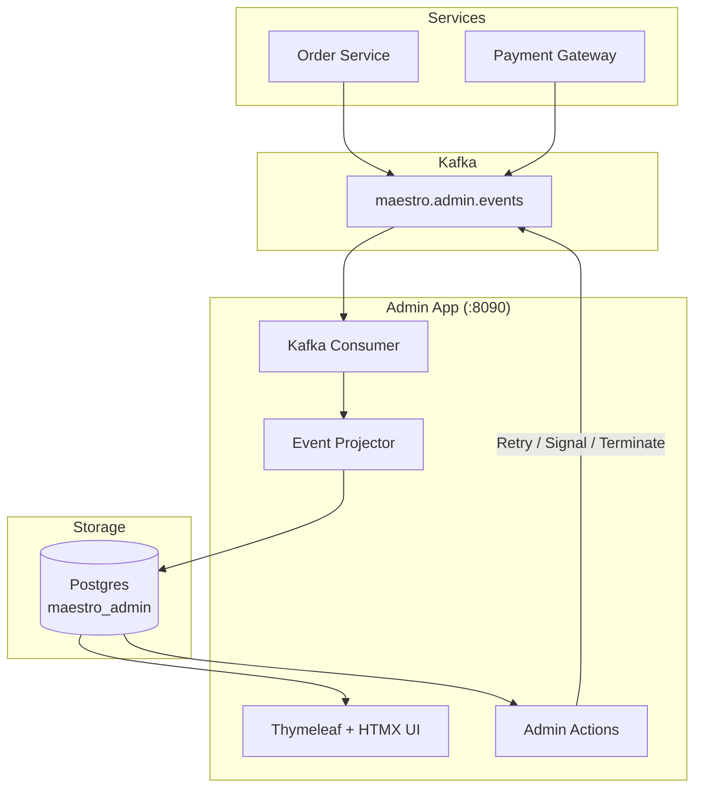

# Admin Dashboard

The Maestro Admin Dashboard provides real-time visibility into workflow state across all Maestro-enabled services. It runs as a standalone Spring Boot application, completely decoupled from your workflow services.

[← Back to README](../README.md)

---

## Overview

The Maestro Admin Dashboard is a standalone Spring Boot application that consumes workflow lifecycle events from Kafka, aggregates them in its own Postgres database, and serves a Thymeleaf + HTMX web UI on port 8090. It requires no access to your service databases -- it reads everything from Kafka.

The dashboard is completely decoupled from your services. If the dashboard goes down, your workflows continue running unaffected. When the dashboard comes back up, it catches up on missed events from Kafka.

---

## Architecture



**Event flow:**

1. Services publish `WorkflowLifecycleEvent` records (workflow started, activity completed, workflow failed, etc.) to the `maestro.admin.events` Kafka topic.
2. The admin app's `AdminEventConsumer` consumes these events using consumer group `maestro-admin` with per-record acknowledgement.
3. The `EventProjector` upserts the event data into four admin-owned tables: `admin_service`, `admin_workflow`, `admin_event`, and `admin_metrics`.
4. The Thymeleaf + HTMX UI queries these tables to render dashboards, workflow lists, and event timelines.
5. Admin actions (retry, terminate, send signal) are published back to Kafka on per-service signal topics (`maestro.signals.{serviceName}`) for the target service to pick up.

**Lifecycle event types** published by the engine:

| Event Type | Description |
|---|---|
| `WORKFLOW_STARTED` | Workflow execution began |
| `WORKFLOW_COMPLETED` | Workflow completed successfully |
| `WORKFLOW_FAILED` | Workflow failed (retries exhausted or compensation done) |
| `WORKFLOW_TERMINATED` | Workflow terminated by admin action |
| `ACTIVITY_STARTED` | An activity execution began |
| `ACTIVITY_COMPLETED` | An activity completed successfully |
| `ACTIVITY_FAILED` | An activity execution failed |
| `SIGNAL_RECEIVED` | A signal was received by a workflow |
| `SIGNAL_TIMEOUT` | A signal await timed out |
| `TIMER_SCHEDULED` | A durable timer was scheduled |
| `TIMER_FIRED` | A durable timer fired |
| `COMPENSATION_STARTED` | Saga compensation started |
| `COMPENSATION_COMPLETED` | Saga compensation completed |
| `COMPENSATION_STEP_COMPLETED` | An individual compensation step completed |
| `COMPENSATION_STEP_FAILED` | An individual compensation step failed |

---

## Setup with Docker Compose

The project's `docker-compose.yml` includes the admin dashboard as a service:

```yaml
admin-dashboard:
  build:
    context: .
    target: admin-dashboard
  ports:
    - "8090:8090"
  environment:
    POSTGRES_HOST: postgres
    POSTGRES_PORT: 5432
    ADMIN_DB: maestro_admin
    POSTGRES_USER: maestro
    POSTGRES_PASSWORD: maestro
    KAFKA_BOOTSTRAP: kafka:9092
    SERVER_PORT: 8090
  depends_on:
    postgres:
      condition: service_healthy
    kafka:
      condition: service_healthy
    kafka-init:
      condition: service_completed_successfully
```

### Admin database initialization

The admin dashboard uses a separate Postgres database (`maestro_admin`), not the same database as your workflow services. The `docker/init-admin-db.sh` script creates it on first startup:

```bash
#!/bin/bash
set -e
psql -v ON_ERROR_STOP=1 --username "$POSTGRES_USER" --dbname "$POSTGRES_DB" <<-EOSQL
    CREATE DATABASE maestro_admin;
    GRANT ALL PRIVILEGES ON DATABASE maestro_admin TO $POSTGRES_USER;
EOSQL
```

This script is mounted into Postgres's `docker-entrypoint-initdb.d/` directory and runs only on first initialization (fresh volume). In the project's `docker-compose.yml`, this is already configured:

```yaml
postgres:
  volumes:
    - ./docker/init-admin-db.sh:/docker-entrypoint-initdb.d/init-admin-db.sh
```

### Schema migration

The admin schema is managed by Flyway and applied automatically on startup. Migrations live in `maestro-admin/src/main/resources/db/migration/admin/`. The schema creates four tables:

- **`admin_service`** -- Discovered services (auto-populated from event `serviceName` field)
- **`admin_workflow`** -- Projected workflow state (status, last step, timestamps, event count)
- **`admin_event`** -- Full event timeline log (one row per lifecycle event)
- **`admin_metrics`** -- Pre-computed workflow counts by service and status

### Kafka topic

The `maestro.admin.events` topic must be pre-created. The `kafka-init` service in `docker-compose.yml` handles this:

```bash
kafka-topics.sh --create --if-not-exists --topic maestro.admin.events --partitions 1 --replication-factor 1
```

---

## Enabling Event Publishing in Services

Services must include the `maestro-admin-client` dependency to publish lifecycle events to the dashboard:

```kotlin
// build.gradle.kts
dependencies {
    implementation("io.b2mash.maestro:maestro-admin-client")
}
```

```yaml
# application.yml
maestro:
  admin:
    events:
      enabled: true
      topic: maestro.admin.events
```

Event publishing is **enabled by default** (`enabled: true`). Adding the dependency is sufficient -- no additional configuration is required unless you need to change the topic name.

Set `enabled: false` to disable publishing (e.g., in test environments):

```yaml
maestro:
  admin:
    events:
      enabled: false
```

The `AdminEventPublisher` uses **fire-and-forget** semantics: publishing failures are logged at `WARN` level and silently swallowed. Lifecycle event failures never interrupt workflow execution.

---

## Dashboard Pages

The admin UI consists of six pages, accessible via the navigation bar:

| Page | URL | Description |
|---|---|---|
| **Overview** | `/admin` | Aggregate workflow counts by status per service. Metrics auto-refresh every 5 seconds via HTMX polling. |
| **Workflows** | `/admin/workflows` | Paginated, filterable table of all workflows across services. Filter by service, status, or free-text search against workflow ID and type. |
| **Workflow Detail** | `/admin/workflows/{workflowId}` | Full event timeline for a single workflow instance. Shows each lifecycle event with timestamps, step names, and expandable JSON detail payloads. |
| **Failed** | `/admin/failed` | Filtered view of failed workflows, sorted by most recent. One-click retry from this page. |
| **Signals** | `/admin/signals` | Signal monitor showing `SIGNAL_RECEIVED` and `SIGNAL_TIMEOUT` events. Helps identify workflows stuck waiting for signals that never arrived. |
| **Timers** | `/admin/timers` | Timer monitor showing `TIMER_SCHEDULED` and `TIMER_FIRED` events. Spot overdue timers and timer misconfigurations. |

All list pages support pagination. Filter and pagination state is preserved via query parameters, and HTMX swaps table fragments without full page reloads.

---

## Admin Actions

Operators can take the following actions from the workflow detail page. Each action publishes a command message to the target service's signal topic (`maestro.signals.{serviceName}`):

| Action | Endpoint | Description | Use Case |
|---|---|---|---|
| **Retry** | `POST /admin/workflows/{id}/retry` | Sends a `$maestro:retry` signal. The workflow resumes from its last failed step. | Transient failures resolved, external API outage ended. |
| **Terminate** | `POST /admin/workflows/{id}/terminate` | Sends a `$maestro:terminate` signal. The workflow stops immediately without compensation. | Stuck workflows, bad data, manual intervention needed. |
| **Send Signal** | `POST /admin/workflows/{id}/signal` | Sends an application-level signal with a name and optional JSON payload. | Missing Kafka events, manual approval flows, testing. |

All actions produce a flash message confirming success or reporting failure, then redirect back to the workflow detail page.

**Note:** Admin commands use internal signal names prefixed with `$maestro:` (e.g., `$maestro:retry`, `$maestro:terminate`) to distinguish them from application-level signals.

---

## Configuration Reference

### Admin dashboard (`maestro-admin`)

All properties are configured in the admin app's `application.yml`:

| Property | Default | Description |
|---|---|---|
| `server.port` | `8090` | HTTP port for the dashboard |
| `spring.datasource.url` | `jdbc:postgresql://localhost:5432/maestro_admin` | Admin database JDBC URL |
| `spring.datasource.username` | `maestro` | Database username |
| `spring.datasource.password` | `maestro` | Database password |
| `maestro.admin.events-topic` | `maestro.admin.events` | Kafka topic to consume lifecycle events from |
| `maestro.admin.consumer-group` | `maestro-admin` | Kafka consumer group ID |
| `maestro.admin.signal-topic-prefix` | `maestro.signals.` | Prefix for per-service signal topics (used for admin actions) |
| `spring.kafka.bootstrap-servers` | `localhost:29092` | Kafka bootstrap servers |

### Admin client (`maestro-admin-client`)

Configured in each service's `application.yml`:

| Property | Default | Description |
|---|---|---|
| `maestro.admin.events.enabled` | `true` | Enable or disable lifecycle event publishing |
| `maestro.admin.events.topic` | `maestro.admin.events` | Kafka topic to publish lifecycle events to |

---

## Standalone Deployment

The admin dashboard can run independently in several ways:

**As a Docker container** (alongside your services via Docker Compose, as shown above).

**As a standalone JAR:**

```bash
java -jar maestro-admin.jar \
  --spring.datasource.url=jdbc:postgresql://db-host:5432/maestro_admin \
  --spring.datasource.username=maestro \
  --spring.datasource.password=maestro \
  --spring.kafka.bootstrap-servers=kafka-host:9092
```

**In Kubernetes** as a separate Deployment with its own service and ingress.

### Requirements

The dashboard only needs:

- **Kafka access** -- to consume lifecycle events and publish admin action commands
- **Its own Postgres database** -- separate from service databases; schema is auto-migrated by Flyway on startup

No access to service databases is required. The dashboard reconstructs workflow state entirely from Kafka events.

### Resilience

- **Dashboard downtime** has zero impact on running workflows. Services continue executing normally.
- **On restart**, the Kafka consumer group (`maestro-admin`) resumes from the last committed offset, catching up on missed events.
- **Event processing errors** are logged per-message without crashing the consumer. A single malformed event does not block subsequent events.

---

## See Also

- [Configuration](configuration.md) -- Full configuration reference for all Maestro modules
- [Cross-Service Patterns](cross-service.md) -- How services communicate via signals and Kafka events
- [Concepts](concepts.md) -- Core concepts: workflows, activities, signals, timers, sagas
- [Self-Recovery](self-recovery.md) -- How Maestro handles crash recovery and signal persistence
