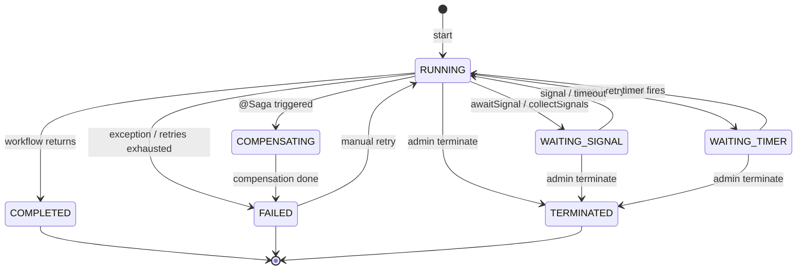

# Core Concepts

**Maestro is an embeddable durable workflow engine delivered as a Spring Boot Starter.**

[← Back to README](../README.md)

---

## Overview

Maestro gives your Spring Boot microservice Temporal.io-grade workflow durability without a central server. Add a starter dependency, point it at your existing Postgres, Kafka, and Valkey/Redis, and your workflows become crash-recoverable.

The three infrastructure components (store, messaging, lock) are each defined as a Service Provider Interface (SPI), allowing different implementations to be swapped via configuration. See [Configuration](configuration.md) for available backends.

The engine uses **hybrid memoization**: every activity call is intercepted by a proxy that checks Postgres for a stored result at the current sequence number. If found (replay), the stored result is returned instantly without re-execution. If not found (live), the activity executes, its result is persisted, and execution continues. On recovery after a crash, the workflow method is re-invoked from the top -- completed steps replay in microseconds, and execution resumes from the first uncompleted step.

---

## Durable Workflows

A durable workflow is a plain Java class annotated with `@DurableWorkflow`. It contains the orchestration logic that calls activities, waits for signals, sleeps, and branches in parallel. The engine runs each workflow instance on its own Java virtual thread.

Each workflow class must have exactly one method annotated with `@WorkflowMethod`. This is the entry point that the engine invokes when a new workflow starts and re-invokes during crash recovery.

```java
@DurableWorkflow(name = "order-fulfilment", taskQueue = "orders")
public class OrderFulfilmentWorkflow {

    @ActivityStub(startToCloseTimeout = "PT30S",
                  retryPolicy = @RetryPolicy(maxAttempts = 3))
    private InventoryActivities inventory;

    @ActivityStub(startToCloseTimeout = "PT10S")
    private NotificationActivities notifications;

    private volatile String currentStep = "CREATED";

    @WorkflowMethod
    public OrderResult fulfil(OrderInput input) {
        var workflow = WorkflowContext.current();

        currentStep = "RESERVING_INVENTORY";
        var reservation = inventory.reserve(input.items());

        currentStep = "AWAITING_PAYMENT";
        var payment = workflow.awaitSignal(
            "payment.result", PaymentResult.class, Duration.ofHours(1));

        currentStep = "COMPLETED";
        notifications.notifyCustomer(input.customerId(), "Order confirmed!");
        return OrderResult.success(input.orderId(), reservation.warehouseId());
    }
}
```

**Key points:**

- `name` defaults to the class simple name if omitted. It correlates instances with their implementation during recovery.
- `taskQueue` defaults to `"default"`. Only workers subscribed to a matching queue execute workflows of this type.
- The `@WorkflowMethod` may accept zero or one parameter (the workflow input) and its return type is serialized as the workflow output.
- **One `@WorkflowMethod` per class.** Multiple workflow types require separate classes.

---

## Activities

Activities are the units of work that a workflow orchestrates. They represent the actual side-effects: calling an API, writing to a database, sending a message. Activities are defined as interfaces annotated with `@Activity` and injected into workflows via `@ActivityStub` fields.

### Defining an activity interface

```java
@Activity
public interface InventoryActivities {

    @Compensate("releaseReservation")
    ReservationConfirmation reserve(List<OrderItem> items);

    void releaseReservation(ReservationConfirmation reservation);
}
```

### Implementing an activity

The implementation is a plain Spring bean. No special annotations are needed on the class itself.

```java
@Service
public class InventoryService implements InventoryActivities {

    @Override
    public ReservationConfirmation reserve(List<OrderItem> items) {
        // Real inventory logic: call database, external API, etc.
        return new ReservationConfirmation("rsv-123", "warehouse-east", totalPrice);
    }

    @Override
    public void releaseReservation(ReservationConfirmation reservation) {
        // Undo the reservation
    }
}
```

### Injecting into a workflow

```java
@ActivityStub(startToCloseTimeout = "PT30S",
              retryPolicy = @RetryPolicy(maxAttempts = 3,
                                         initialInterval = "PT1S",
                                         maxInterval = "PT1M",
                                         backoffMultiplier = 2.0))
private InventoryActivities inventory;
```

**How memoization works:** When the workflow calls `inventory.reserve(items)`, the activity proxy:

1. Reads the current sequence number from the `WorkflowContext` (e.g., sequence `1`).
2. Checks Postgres for a stored event at `(workflowInstanceId, 1)`.
3. **Replay (found):** Deserializes and returns the stored result. No execution occurs.
4. **Live (not found):** Executes the real activity method, serializes and persists the result, then returns it.

This is what makes workflows crash-recoverable. After a JVM restart, the engine re-invokes the `@WorkflowMethod`. Each activity call replays its stored result in microseconds until execution reaches the first step that never completed, then resumes live execution from there.

### Retry policy

The `@RetryPolicy` annotation configures automatic retries for failed activity invocations:

| Attribute | Default | Description |
|---|---|---|
| `maxAttempts` | `3` | Total attempts including the initial call |
| `initialInterval` | `"PT1S"` | Initial delay between retries (ISO 8601) |
| `maxInterval` | `"PT1M"` | Maximum delay cap (ISO 8601) |
| `backoffMultiplier` | `2.0` | Multiplier applied after each retry |
| `retryableExceptions` | `{}` (all) | Only retry these exception types |
| `nonRetryableExceptions` | `{}` (none) | Never retry these exception types |

Backoff formula: `delay = min(initialInterval * backoffMultiplier^attempt, maxInterval)`.

---

## The Determinism Rule

**Code between activity calls must be deterministic.** This is the single most important rule for workflow authors.

Because the engine replays the workflow method during crash recovery, any non-deterministic code between activity calls will produce different results on replay, corrupting the memoization sequence. The workflow will diverge from its stored event history and fail.

### Do / Don't table

| Don't (non-deterministic) | Do (deterministic alternative) |
|---|---|
| `Math.random()` | `workflow.randomUUID()` |
| `UUID.randomUUID()` | `workflow.randomUUID()` |
| `LocalDateTime.now()` | `workflow.currentTime()` |
| `Instant.now()` | `workflow.currentTime()` |
| `Thread.sleep(ms)` | `workflow.sleep(duration)` |
| Direct HTTP calls | Wrap in an activity method |
| File I/O | Wrap in an activity method |
| Database queries | Wrap in an activity method |

**Safe between activity calls:** conditionals, loops, string manipulation, arithmetic, creating DTOs from activity results, logging. These are deterministic because they operate on values that were already memoized.

```java
@WorkflowMethod
public OrderResult fulfil(OrderInput input) {
    var workflow = WorkflowContext.current();
    var reservation = inventory.reserve(input.items());

    // SAFE: conditional logic on memoized data
    if (reservation.total().compareTo(BigDecimal.valueOf(1000)) > 0) {
        notifications.notifyRiskTeam(input.orderId());
    }

    // WRONG: non-deterministic code between activity calls
    // var now = Instant.now();              // breaks replay
    // var id = UUID.randomUUID().toString(); // breaks replay

    // RIGHT: use memoized alternatives
    var now = workflow.currentTime();
    var id = workflow.randomUUID();

    return new OrderResult(reservation, now, id);
}
```

---

## Signals

Signals deliver external data into a running workflow. A workflow can pause and wait for a named signal, and any external caller can send that signal at any time.

### Awaiting a signal

`workflow.awaitSignal(signalName, type, timeout)` parks the workflow's virtual thread until the signal arrives or the timeout elapses. On timeout, it throws `SignalTimeoutException` -- it does **not** return null.

```java
var workflow = WorkflowContext.current();

try {
    PaymentResult payment = workflow.awaitSignal(
        "payment.result", PaymentResult.class, Duration.ofHours(1));

    // Signal received -- payment contains the payload
    if (payment.success()) {
        shipping.createShipment(orderId, address, warehouseId);
    }
} catch (SignalTimeoutException e) {
    // No signal received within 1 hour
    notifications.notifyCustomer(customerId, "Payment timed out");
    return OrderResult.failed("Payment timed out");
}
```

### Collecting multiple signals

`workflow.collectSignals(signalName, type, count, timeout)` waits for exactly `count` signals with the same name. This enables quorum patterns like "wait for 3 out of 5 approvals":

```java
List<ApprovalResult> approvals = workflow.collectSignals(
    "manager.approval", ApprovalResult.class, 3, Duration.ofDays(7));
```

### Sending a signal

From outside the workflow, use the `MaestroClient`:

```java
maestro.getWorkflow("order-abc").signal("payment.result", paymentResult);
```

### Signal durability

Signals are persisted to Postgres immediately on delivery. This means:

- **Signal arrives before `awaitSignal()`:** Stored and consumed when the workflow reaches the await point.
- **Signal arrives before the workflow even starts:** Stored with a null instance ID, adopted when the workflow starts.
- **Signal arrives while the service is down:** Persisted, found during recovery.

Signals are never lost. See [Self-Recovery](self-recovery.md) for the full durability model.

---

## Durable Timers

`workflow.sleep(Duration)` creates a persistent timer in Postgres, parks the workflow's virtual thread, and resumes when the timer fires. Unlike `Thread.sleep()`, durable timers survive JVM restarts.

```java
var workflow = WorkflowContext.current();

// Reserve inventory, then wait 30 minutes for payment
var reservation = inventory.reserve(items);
workflow.sleep(Duration.ofMinutes(30));

// This code runs 30 minutes later -- even if the JVM restarted
var status = payment.checkStatus(orderId);
```

A leader-elected **timer poller** runs on one node in the cluster, querying Postgres for due timers and firing them. The leader election uses Valkey with a 15-second TTL lease.

---

## Queries

Queries let external callers read the current state of a running workflow without modifying it. Define query handlers with `@QueryMethod` on the workflow class.

```java
@DurableWorkflow(name = "order-fulfilment", taskQueue = "orders")
public class OrderFulfilmentWorkflow {

    private volatile String currentStep = "CREATED";
    private volatile int itemsProcessed = 0;

    @WorkflowMethod
    public OrderResult fulfil(OrderInput input) {
        currentStep = "RESERVING_INVENTORY";
        var reservation = inventory.reserve(input.items());
        itemsProcessed = input.items().size();
        currentStep = "AWAITING_PAYMENT";
        // ...
    }

    @QueryMethod
    public OrderStatus getStatus() {
        return new OrderStatus(currentStep);
    }

    @QueryMethod(name = "progress")
    public int getItemsProcessed() {
        return itemsProcessed;
    }
}
```

**Invoking a query** from outside the workflow:

```java
OrderStatus status = maestro.getWorkflow("order-abc")
    .query("getStatus", OrderStatus.class);

int progress = maestro.getWorkflow("order-abc")
    .query("progress", Integer.class);
```

**Thread safety:** Query methods are invoked from the **caller's thread**, not the workflow's virtual thread. Use `volatile` fields, `AtomicReference`, or explicit synchronization to ensure visibility of state written by the workflow thread.

**Read-only contract:** Query methods must not modify workflow state or trigger side effects. Doing so will corrupt determinism and break replay.

---

## Saga Compensation

Sagas provide automatic rollback when a workflow fails partway through. Annotate the `@WorkflowMethod` with `@Saga` and declare compensation methods on your activity interfaces with `@Compensate`.

### Declarative compensation

```java
@Activity
public interface InventoryActivities {

    @Compensate("releaseReservation")
    ReservationConfirmation reserve(List<OrderItem> items);

    void releaseReservation(ReservationConfirmation reservation);
}
```

```java
@WorkflowMethod
@Saga(parallelCompensation = false)
public OrderResult fulfil(OrderInput input) {
    // Step 1: reserve inventory -- compensation registered automatically
    var reservation = inventory.reserve(input.items());

    // Step 2: charge payment
    var payment = payment.charge(input.paymentMethod(), reservation.total());

    // Step 3: arrange shipment -- if this fails:
    //   1. payment.refund() runs (most recent first)
    //   2. inventory.releaseReservation() runs
    var shipment = shipping.createShipment(input.orderId(), input.shippingAddress());

    return OrderResult.success(input.orderId(), shipment.trackingNumber());
}
```

### Manual compensation

For cases where declarative `@Compensate` is not flexible enough, push compensations manually:

```java
var workflow = WorkflowContext.current();

var reservation = inventory.reserve(items);
workflow.addCompensation(() -> inventory.releaseReservation(reservation));

// Or with a name for logging
workflow.addCompensation("release-reservation",
    () -> inventory.releaseReservation(reservation));
```

### Compensation ordering

Compensations form a **LIFO stack** -- they unwind in reverse registration order (most recent first). Set `@Saga(parallelCompensation = true)` to execute all compensations concurrently instead.

Compensation calls go through the activity proxy and are therefore memoized, retriable, and replayable, just like normal activity calls.

### Compensation argument resolution

The compensation method's arguments are resolved by convention:

1. **No parameters:** Called with no arguments.
2. **Single parameter assignable from the activity's return type:** The return value is passed.
3. **Parameters matching the activity's parameters:** The original arguments are passed.

Incompatible signatures are detected at startup (fail-fast).

---

## Parallel Execution

`workflow.parallel(List<Callable<T>>)` spawns N virtual threads and executes them concurrently. Each branch gets an independent sequence space for memoization.

```java
var workflow = WorkflowContext.current();

List<ShipmentConfirmation> shipments = workflow.parallel(List.of(
    () -> shipping.createShipment("order-1", addressA, "warehouse-east"),
    () -> shipping.createShipment("order-2", addressB, "warehouse-west"),
    () -> shipping.createShipment("order-3", addressC, "warehouse-east")
));
```

### Compound sequence keys

When parallel execution occurs at sequence step `5`, each branch receives a compound key: `5.0`, `5.1`, `5.2`. This means:

- Each branch is independently memoized.
- On replay, each branch replays its own stored events regardless of original execution order.
- Results are returned in the same order as the input task list.

---

## Retry Until

`workflow.retryUntil(supplier, predicate, options)` polls a supplier until a predicate is satisfied, with durable backoff between attempts. This is for polling patterns where the activity succeeds but returns an unsatisfactory result (as opposed to `@RetryPolicy`, which retries on exceptions).

```java
var workflow = WorkflowContext.current();

var options = RetryUntilOptions.builder()
    .maxAttempts(20)
    .maxDuration(Duration.ofHours(2))
    .initialInterval(Duration.ofSeconds(10))
    .maxInterval(Duration.ofMinutes(5))
    .backoffMultiplier(2.0)
    .build();

PaymentStatus status = workflow.retryUntil(
    () -> payment.checkStatus(orderId),       // supplier (must be activity call)
    result -> result.isSettled(),              // predicate
    options
);
```

Each backoff interval creates a durable timer via `workflow.sleep()`, so the entire retry loop survives JVM restarts. The supplier must be a memoized activity call -- passing a raw lambda that performs I/O will break deterministic replay.

Throws `RetryExhaustedException` if all attempts are exhausted or the maximum duration is exceeded.

---

## WorkflowContext API Reference

Access the context via `WorkflowContext.current()` or `WorkflowContext.workflow()` (alias) from within a workflow method.

```java
var workflow = WorkflowContext.current();
```

| Method | Return Type | Description |
|---|---|---|
| `sleep(Duration)` | `void` | Durable sleep. Creates a persistent timer that survives restarts. |
| `awaitSignal(name, type, timeout)` | `<T> T` | Wait for a named signal. Throws `SignalTimeoutException` on timeout. |
| `collectSignals(name, type, count, timeout)` | `<T> List<T>` | Collect exactly N signals. Throws `SignalTimeoutException` on timeout. |
| `parallel(List<Callable<T>>)` | `<T> List<T>` | Execute branches in parallel on virtual threads. |
| `currentTime()` | `Instant` | Memoized current time. Use instead of `Instant.now()`. |
| `randomUUID()` | `String` | Memoized UUID string. Use instead of `UUID.randomUUID()`. |
| `retryUntil(supplier, predicate, options)` | `<T> T` | Poll with durable backoff. Throws `RetryExhaustedException`. |
| `addCompensation(Runnable)` | `void` | Push an anonymous compensation onto the saga stack. |
| `addCompensation(name, Runnable)` | `void` | Push a named compensation onto the saga stack. |
| `workflowId()` | `String` | The business workflow ID (e.g., `"order-abc"`). |
| `workflowInstanceId()` | `UUID` | The internal workflow instance UUID (primary key). |
| `workflowType()` | `String` | The workflow type name (from `@DurableWorkflow.name`). |
| `taskQueue()` | `String` | The task queue name. |
| `isReplaying()` | `boolean` | Whether the engine is currently replaying stored events. |

---

## MaestroClient API Reference

Inject `MaestroClient` into your Spring beans to start workflows, send signals, and query state.

```java
@Service
public class OrderService {

    private final MaestroClient maestro;

    public OrderService(MaestroClient maestro) {
        this.maestro = maestro;
    }
}
```

### Starting a workflow (fire and forget)

```java
var options = WorkflowOptions.builder()
    .workflowId("order-" + orderId)
    .build();

UUID instanceId = maestro.newWorkflow(OrderFulfilmentWorkflow.class, options)
    .startAsync(input);
```

`startAsync` accepts the workflow input (or `null` for no-arg workflows) and returns the workflow instance UUID immediately.

### Starting a workflow and waiting for the result

```java
OrderResult result = maestro.newWorkflow(OrderFulfilmentWorkflow.class, options)
    .startAndWait(input, Duration.ofMinutes(5), OrderResult.class);
```

`startAndWait` starts the workflow, then polls the store until it reaches a terminal state or the timeout elapses. Throws `TimeoutException` if the workflow does not complete in time, or `WorkflowExecutionException` if it fails.

### Sending a signal

```java
maestro.getWorkflow("order-abc").signal("payment.result", paymentResult);
```

### Querying workflow state

```java
OrderStatus status = maestro.getWorkflow("order-abc")
    .query("getStatus", OrderStatus.class);
```

The query name is the `@QueryMethod.name` attribute, or the method name if `name` is empty.

For queries that accept an argument:

```java
DetailedStatus detail = maestro.getWorkflow("order-abc")
    .query("getDetail", "verbose", DetailedStatus.class);
```

---

## State Machine

Every workflow instance follows a deterministic state machine.



### State descriptions

| State | Description |
|---|---|
| **RUNNING** | The workflow is actively executing on a virtual thread. Activity calls, signal handling, and timer creation happen in this state. |
| **WAITING_SIGNAL** | The workflow called `awaitSignal()` or `collectSignals()` and is parked, waiting for an external signal or timeout. |
| **WAITING_TIMER** | The workflow called `sleep()` or `retryUntil()` and is parked, waiting for a durable timer to fire. |
| **COMPLETED** | The `@WorkflowMethod` returned normally. This is a terminal state. The return value is persisted as the workflow output. |
| **FAILED** | The workflow threw an exception after retries were exhausted, or saga compensation completed. This is a terminal state. |
| **COMPENSATING** | A `@Saga`-annotated workflow failed and the engine is unwinding the compensation stack in LIFO order. Transitions to FAILED when done. |
| **TERMINATED** | An administrator explicitly terminated the workflow via the admin dashboard. This is a terminal state. |

### Transitions

- **RUNNING -> WAITING_SIGNAL:** The workflow calls `awaitSignal()` or `collectSignals()`. The instance status is updated in Postgres and the virtual thread parks.
- **WAITING_SIGNAL -> RUNNING:** A signal arrives (delivered via `MaestroClient.signal()` or `@MaestroSignalListener`), or the timeout elapses (throwing `SignalTimeoutException`).
- **RUNNING -> WAITING_TIMER:** The workflow calls `sleep()` or enters a `retryUntil()` backoff interval. A timer row is persisted in Postgres.
- **WAITING_TIMER -> RUNNING:** The timer poller finds a due timer and fires it, unparking the virtual thread.
- **RUNNING -> COMPLETED:** The `@WorkflowMethod` returns a value. The output is serialized and stored.
- **RUNNING -> FAILED:** An unhandled exception propagates out of the `@WorkflowMethod`, or activity retries are exhausted.
- **RUNNING -> COMPENSATING:** A `@Saga`-annotated workflow fails. The engine begins unwinding the compensation stack.
- **COMPENSATING -> FAILED:** All compensations have executed (or failed). The workflow transitions to FAILED.
- **FAILED -> RUNNING:** An administrator triggers a manual retry. The workflow re-invokes from the top, replaying all memoized steps.
- **Any active -> TERMINATED:** An administrator terminates the workflow. No further processing occurs.

---

## What's Next

- [Getting Started](getting-started.md) -- Build your first workflow
- [Configuration](configuration.md) -- All `maestro.*` properties
- [Self-Recovery](self-recovery.md) -- How signals survive crashes
- [Cross-Service Patterns](cross-service.md) -- Multi-service coordination
- [Testing](testing.md) -- Using `maestro-test`
- [Admin Dashboard](admin.md) -- Monitoring and management
