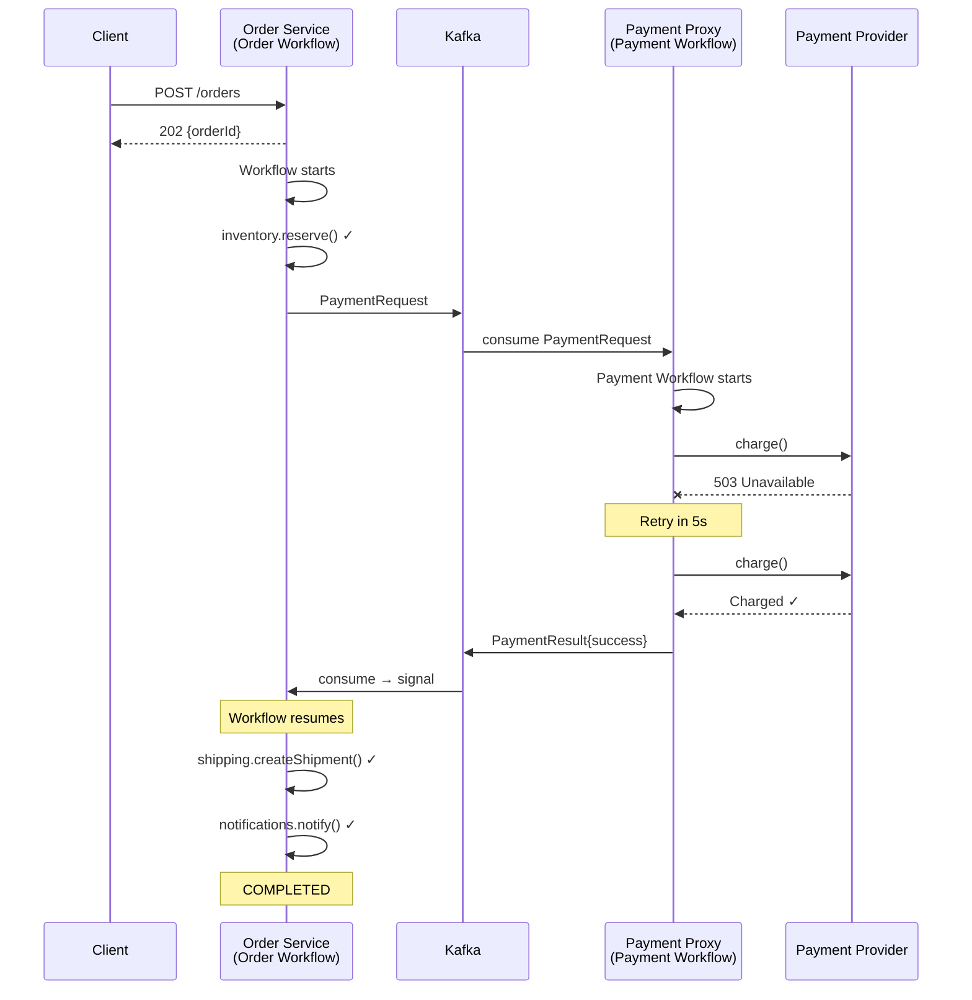

# Cross-Service Patterns

How Maestro coordinates work across multiple microservices without distributed
transactions or a central orchestrator.

[← Back to README](../README.md)

---

## The Pattern: Orchestration Within, Choreography Between

Maestro follows a simple boundary rule:

- **Within a service**, Maestro _orchestrates_. A workflow method defines a
  deterministic sequence of activity calls. The engine controls the order,
  handles retries, persists state, and manages compensation. This is explicit,
  testable, and debuggable.

- **Between services**, coordination happens through _choreography_. Services
  publish domain events to Kafka. Other services consume those events and map
  them to workflow signals. There is no central process that reaches into
  multiple services.

This matters because the alternative -- a distributed orchestrator that calls
into multiple services -- creates a single point of failure, a coupling magnet,
and an operational headache. Maestro avoids all of that.

Each service owns its own:

- **Postgres schema** (or at minimum its own table prefix) for workflow state
- **Kafka consumer group** for message processing
- **Valkey keyspace** for locks and dedup
- **Workflow definitions** for its domain logic

No service reads another service's Maestro tables. No service sends Maestro
internal messages to another service. The only thing that crosses service
boundaries is a domain event on a Kafka topic that both teams agreed to.

---

## How It Works

The following diagram shows a complete cross-service flow between an Order
Service and a Payment Gateway:



### Step-by-step walkthrough

1. **Client places an order.** The Order Service creates a workflow instance
   with a deterministic ID (`"order-" + orderId`) and returns `202 Accepted`
   immediately. The workflow starts asynchronously on a virtual thread.

2. **Inventory is reserved.** This is a memoized activity call. If the service
   crashes after this step, replay will skip it and return the stored result.

3. **Payment request is published.** The workflow publishes a domain event
   (`PaymentRequest`) to a Kafka topic. This is also a memoized activity --
   the publish is idempotent via the dedup key.

4. **Payment Gateway consumes the event.** It starts its own Maestro workflow
   to process the payment. This workflow is completely independent -- it has its
   own state, its own retry policy, its own Postgres records.

5. **Payment retries transparently.** The Payment Workflow's activity has a
   retry policy with exponential backoff. The gateway retries the provider call
   without the Order Service knowing or caring. If the gateway crashes mid-retry,
   the workflow recovers and continues retrying.

6. **Payment result flows back via Kafka.** The Payment Gateway publishes a
   `PaymentResult` event. The Order Service has a `@MaestroSignalListener` that
   maps this event to a workflow signal.

7. **Order Workflow resumes.** The signal wakes the workflow (via Valkey pub/sub
   for instant notification, or via the next poll cycle if Valkey is unavailable).
   The workflow continues with shipment and notification activities.

The key insight: neither service knows it is talking to another Maestro workflow.
The Order Service publishes a `PaymentRequest` and waits for a `PaymentResult`.
The Payment Gateway could be replaced with a Lambda function, a manual process,
or a third-party webhook -- the Order Workflow would not change.

---

## Signal Routing with @MaestroSignalListener

`@MaestroSignalListener` is the bridge between Kafka domain events and Maestro
workflow signals. It transforms an incoming Kafka message into a signal delivery
instruction.

```java
@MaestroSignalListener(
    topic = "payments.results",
    signalName = "payment.result"
)
public SignalRouting routePaymentResult(PaymentResultEvent event) {
    return SignalRouting.builder()
        .workflowId("order-" + event.orderId())
        .payload(new PaymentResult(event.success(), event.transactionId(), event.reason()))
        .build();
}
```

**How it works:**

1. The method receives a deserialized Kafka message (`PaymentResultEvent`).
2. It returns a `SignalRouting` that tells Maestro two things:
   - **Which workflow** should receive the signal (`workflowId`)
   - **What payload** to deliver (`payload`)
3. Maestro persists the signal to Postgres immediately. This is critical --
   even if the target workflow is not currently running, the signal is safe.
4. Maestro notifies the target workflow via Valkey pub/sub for instant wake-up.
   If Valkey is unavailable, the workflow will pick up the signal on its next
   poll cycle. Either way, the signal is never lost.

**Design principle:** The listener method should be a thin routing layer. Extract
the workflow ID, map the payload, and return. Business logic belongs in the
workflow, not in the listener. This keeps signal routing testable and
predictable.

**Signal persistence guarantees:**

| Scenario | What happens |
|---|---|
| Signal arrives while workflow is in `awaitSignal()` | Persisted and delivered immediately |
| Signal arrives before workflow reaches `awaitSignal()` | Persisted, consumed when workflow gets there |
| Signal arrives before workflow even starts | Persisted with null instance ID, adopted on workflow start |
| Signal arrives while service is down | Persisted by the _sending_ service's Kafka publish; consumed on restart |

Maestro never discards a signal. This is the foundation of its self-recovery
model.

---

## Kafka Topology

### Topic naming conventions

Maestro uses two categories of Kafka topics: internal topics for engine
mechanics, and domain topics for cross-service communication.

| Topic | Owner | Key | Purpose |
|---|---|---|---|
| `maestro.tasks.{taskQueue}` | Per-service | workflowId | Internal task dispatch -- tells a worker to execute a workflow step |
| `maestro.signals.{serviceName}` | Per-service | workflowId | Inbound signals from `@MaestroSignalListener` routing |
| `maestro.admin.events` | All services | serviceName | Lifecycle events consumed by the admin dashboard |
| Domain topics (e.g., `payments.requests`) | Application | varies | Cross-service domain events -- the choreography layer |

### Consumer groups

Each service gets its own consumer group, defaulting to `maestro-{serviceName}`.
This ensures that every instance of a service in a cluster shares the workload
for that service's topics, while different services each get their own copy of
shared topic messages (like `maestro.admin.events`).

### Why domain topics are separate

Maestro internal topics (`maestro.tasks.*`, `maestro.signals.*`) carry engine
messages -- task dispatch instructions and signal deliveries. Domain topics
(`payments.requests`, `payments.results`) carry business events that multiple
consumers might care about.

Keeping them separate means:

- Domain events can be consumed by services that do not use Maestro at all
- Topic retention, partitioning, and compaction can be configured independently
- Internal topics can be treated as infrastructure; domain topics are owned by
  product teams

**Important:** Maestro never auto-creates Kafka topics. All topics must be
pre-created before starting your services. This is a deliberate operational
safety decision -- see [Topic Pre-Creation](#topic-pre-creation) below.

---

## Example: E-Commerce (Order + Payment)

The `maestro-samples` directory contains a working two-service demo:

- **sample-order-service** (`localhost:8081`) -- Accepts orders via REST, runs
  the `OrderFulfilmentWorkflow` that reserves inventory, requests payment,
  arranges shipping, and notifies the customer.

- **sample-payment-gateway** (`localhost:8082`) -- Consumes payment requests
  from Kafka, runs the `PaymentProcessingWorkflow` with 30 retries and
  exponential backoff against a simulated payment provider with a 30% transient
  failure rate.

The two services coordinate entirely through Kafka:

1. Order Service publishes a `PaymentRequest` to `payments.requests`
2. Payment Gateway consumes it, processes the payment with durable retries
3. Payment Gateway publishes a `PaymentResult` to `payments.results`
4. Order Service's `@MaestroSignalListener` routes the result to the waiting
   `OrderFulfilmentWorkflow`

Each service has its own Maestro tables, its own workflow definitions, and its
own retry policies. They share nothing except Kafka topic contracts.

The demo also shows saga compensation: using the magic payment method
`DECLINE_ME` triggers a payment decline, which causes the Order Workflow to
automatically release the inventory reservation via its compensation handler.

See the [samples README](../maestro-samples/README.md) for instructions on
running this demo with Docker Compose.

---

## Example: Stokvel Onboarding (Parallel + Quorum)

The stokvel onboarding example demonstrates advanced cross-service patterns that
go beyond simple request-response:

**Two services:**
- **Stokvel Service** -- Runs the onboarding workflow that coordinates
  signatory collection, agreement generation, and account activation.
- **Core-Banking Proxy** -- Runs the account provisioning workflow with
  durable retries against an unreliable core banking system, plus saga
  compensation if the account needs to be closed.

**Advanced patterns demonstrated:**

### Parallel branches with mixed timescales

The onboarding workflow waits for two independent concerns simultaneously --
one that takes days (signatory agreements from humans) and one that takes
minutes (account provisioning from a system):

```java
var results = workflow.parallel(List.of(
    // Branch A: Collect 3 signatory agreements (days/weeks)
    () -> workflow.collectSignals(
        "signatory.agreed", SignatoryAgreement.class, 3, Duration.ofDays(30)),
    // Branch B: Await account provisioning (minutes/hours)
    () -> workflow.awaitSignal(
        "account.result", AccountResult.class, Duration.ofDays(7))
));
```

Both branches run concurrently on virtual threads. The workflow does not
proceed until both complete (or time out). Sequence numbers use compound keys
(`5.0`, `5.1`) so that each branch's memoization is independent.

### Quorum signal collection

`workflow.collectSignals("signatory.agreed", ..., 3, Duration.ofDays(30))`
waits for exactly 3 signals with the name `"signatory.agreed"`. Signals arrive
asynchronously over days or weeks as individual signatories interact with a
mobile app. Each signal is persisted immediately. If the service restarts,
previously collected signals are replayed from Postgres -- no signal is ever
lost.

### Cross-service signals with saga compensation

The Core-Banking Proxy uses `@Saga` annotation on its workflow method. If
account creation succeeds but a later step fails, the `@Compensate("closeAccount")`
annotation on the `createAccount` activity ensures the account is cleaned up.
The compensation result is published back to the Stokvel Service via Kafka so
the onboarding workflow can handle the failure gracefully.

See the full [Stokvel Example](example-stokvel.md) for the complete workflow
code, signal routing, configuration, and tests.

---

## Topic Pre-Creation

Maestro never auto-creates Kafka topics. This is intentional.

**Why not auto-create?**

- **Partition count matters.** Too few partitions limit throughput. Too many
  waste resources and increase rebalancing time. The right number depends on
  your workload, and only your operations team knows that.

- **Replication factor matters.** Production topics need replication factor 3
  for durability. Auto-created topics often get replication factor 1 by default,
  which means data loss on broker failure.

- **Topic configuration matters.** Retention, compaction, min ISR -- these are
  operational decisions that affect cost, durability, and performance.

- **Typos create phantom topics.** If a misconfigured service auto-creates a
  topic with a typo, messages go to the wrong topic and the real topic gets no
  consumers. This is painful to debug in production.

**Pre-create topics in your deployment pipeline.** For local development with
Docker Compose, use a kafka-init service:

```yaml
kafka-init:
  image: apache/kafka:3.9.0
  depends_on:
    kafka:
      condition: service_healthy
  entrypoint: ["/bin/sh", "-c"]
  command:
    - |
      KAFKA="/opt/kafka/bin/kafka-topics.sh --bootstrap-server kafka:9092"
      $$KAFKA --create --if-not-exists --topic maestro.tasks.orders --partitions 3
      $$KAFKA --create --if-not-exists --topic maestro.signals.order-service --partitions 3
      $$KAFKA --create --if-not-exists --topic maestro.admin.events --partitions 1
      $$KAFKA --create --if-not-exists --topic payments.requests --partitions 3
      $$KAFKA --create --if-not-exists --topic payments.results --partitions 3
```

For production, create topics in your Terraform, Ansible, or Kubernetes
operator configuration alongside the rest of your Kafka infrastructure.

---

## Per-Service Configuration

Each service configures Maestro independently. The only shared knowledge is the
Kafka topic names that both sides agreed to.

### Order Service

```yaml
maestro:
  service-name: order-service
  messaging:
    topics:
      tasks: maestro.tasks.orders
      signals: maestro.signals.order-service
  worker:
    task-queues:
      - name: orders
        concurrency: 10
```

### Payment Gateway

```yaml
maestro:
  service-name: payment-gateway
  messaging:
    topics:
      tasks: maestro.tasks.payments
      signals: maestro.signals.payment-gateway
  worker:
    task-queues:
      - name: payments
        concurrency: 5
```

Note what is _not_ shared:

- Each service has its own `service-name`, which drives its consumer group
  (`maestro-order-service`, `maestro-payment-gateway`).
- Each service has its own task topic and signal topic.
- Concurrency is tuned independently -- the order service handles more
  concurrent workflows than the payment gateway, which is bottlenecked by
  external provider latency.

The full configuration reference is in [Configuration](configuration.md).

---

## Valkey Coordination

Maestro uses Valkey (or Redis) as a performance optimization layer. It is not
the source of truth -- Postgres is.

| Key Pattern | Purpose | TTL |
|---|---|---|
| `maestro:lock:workflow:{workflowId}` | Workflow instance lock | 30s (auto-renewed) |
| `maestro:dedup:{workflowId}:{seq}` | Activity deduplication | 5m |
| `maestro:leader:timer-poller:{service}` | Timer polling leader election | 15s |
| `maestro:signal:{workflowId}` (pub/sub) | Signal notification channel | N/A |

### What each key does

**Workflow lock** -- Ensures only one node executes a workflow instance at a
time. The lock is acquired when a workflow starts executing and automatically
renewed while it runs. If a node crashes, the lock expires after 30 seconds,
allowing another node to pick up the workflow during recovery.

**Activity dedup** -- Prevents the same activity from executing twice during
recovery. When a workflow replays after a crash, it checks both the Postgres
event log (authoritative) and the Valkey dedup key (fast path). The 5-minute
TTL covers any reasonable recovery window.

**Timer leader** -- Ensures only one node in the cluster polls for due timers.
The 15-second TTL means leadership transfers quickly if the current leader
goes down.

**Signal pub/sub** -- Provides instant wake-up when a signal is delivered. When
a `@MaestroSignalListener` persists a signal, it also publishes a notification
on this channel. The workflow's virtual thread is waiting on a
`CountDownLatch` that the subscriber releases.

### Graceful degradation

If Valkey is unavailable, Maestro does not stop working:

- **Locks** fall back to Postgres advisory locks
- **Dedup** falls back to the unique constraint on
  `(workflow_instance_id, sequence_number)` in the event table
- **Leader election** falls back so that each node polls independently
  (safe but slightly less efficient)
- **Signal notification** falls back to poll-based delivery -- the workflow
  checks for pending signals on each timer poll cycle instead of being woken
  instantly

The system is slower without Valkey, but correct. Postgres is always the
source of truth.

---

## Best Practices

**Make activities idempotent.** Maestro provides at-least-once execution
semantics. An activity might execute more than once if a crash occurs after
execution but before the result is persisted. Design activities so that
re-execution produces the same outcome -- use idempotency keys with external
systems, check-before-write patterns, or database upserts.

**Use meaningful workflow IDs for routing.** Workflow IDs like
`"order-" + orderId` or `"stokvel-" + stokvelId` make signal routing
straightforward. The `@MaestroSignalListener` can derive the target workflow
ID directly from the domain event without needing a lookup table.

**Keep domain events separate from Maestro internal topics.** Maestro internal
topics (`maestro.tasks.*`, `maestro.signals.*`) are engine infrastructure.
Domain topics (`payments.requests`, `payments.results`) are business contracts.
Separating them means non-Maestro services can participate in the choreography,
and topic lifecycle management is cleaner.

**Use @MaestroSignalListener as a thin routing layer.** The listener method
should extract a workflow ID, map a payload, and return a `SignalRouting`. No
database calls, no HTTP requests, no business logic. If routing requires a
lookup (rare), make it fast and idempotent. Business decisions belong in the
workflow.

**Pre-create all Kafka topics in your deployment scripts.** Do not rely on
auto-creation. Include topic creation in your infrastructure-as-code alongside
database migrations and Valkey configuration. See
[Topic Pre-Creation](#topic-pre-creation) above.

**Give each service its own Postgres schema.** At minimum, use a unique
`maestro.store.table-prefix` per service. This prevents workflow ID collisions,
keeps event tables smaller, and allows independent backup and migration
schedules. Two services should never share a `maestro_workflow_instance` table.

**Design for signal reordering.** Signals may arrive in any order relative to
the workflow's execution progress. Maestro handles this correctly -- signals
that arrive before `awaitSignal()` is called are persisted and consumed when
the workflow reaches that point. But your business logic should not assume a
specific signal ordering either.

**Test cross-service flows with TestWorkflowEnvironment.** Each service's
workflow can be tested independently by simulating signals. You do not need to
run Kafka or the other service to verify your workflow logic. Use
`testEnv.advanceTime()` and `handle.signal()` to simulate the full
asynchronous flow in milliseconds.

---

## See Also

- [Concepts](concepts.md) -- Workflows, activities, signals, timers, and the memoization model
- [Self-Recovery](self-recovery.md) -- How Maestro recovers from crashes without losing state
- [Configuration](configuration.md) -- Full reference for all `maestro.*` properties
- [Testing](testing.md) -- Unit testing workflows with TestWorkflowEnvironment
- [Stokvel Example](example-stokvel.md) -- Full multi-service example with parallel branches, quorum, and saga
