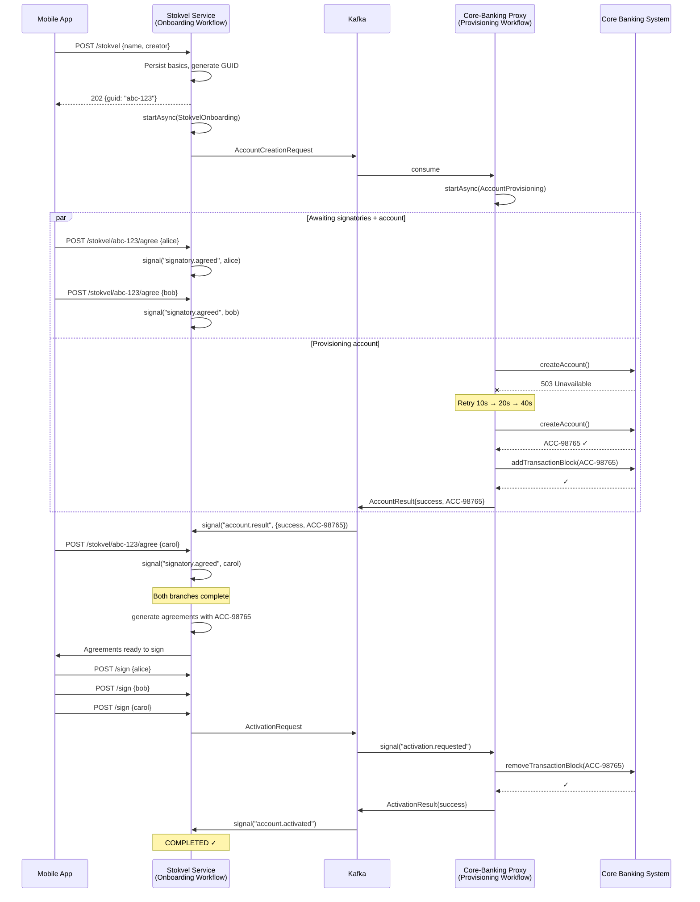

# Maestro Example — Stokvel Group Savings Onboarding

## A Real-World Multi-Service Workflow

This document describes a production-grade example of Maestro powering a stokvel (group savings) onboarding flow across two microservices — a **Stokvel Service** and a **Core-Banking Proxy** — interacting with an unreliable external core banking system.

This example demonstrates every core Maestro capability: durable workflows, parallel execution, signal-based coordination, quorum collection, self-recovery, saga compensation, and durable retries against unreliable external APIs.

---

## 1. Business Context

A stokvel is a group savings account common in Southern African fintech. Onboarding one requires:

1. A customer creates a stokvel via REST API — gets back a GUID immediately.
2. The customer uses the GUID to update details and invite members (standard CRUD, outside Maestro).
3. **In parallel**, an account opening request is sent to a Core-Banking Proxy service which calls an external core banking system (synchronous, unreliable).
4. Three signatories must individually agree to terms — arriving asynchronously over days or weeks via a mobile app.
5. When all 3 have agreed **and** the account is ready, signing agreements are generated (these require the account number from core banking).
6. All 3 sign the agreements digitally.
7. The transaction block is removed and the account is activated.

---

## 2. End-to-End Flow



---

## 3. Stokvel Service — Onboarding Workflow

```java
@DurableWorkflow(name = "stokvel-onboarding", taskQueue = "onboarding")
public class StokvelOnboardingWorkflow {

    @ActivityStub(startToCloseTimeout = "PT30S",
                  retryPolicy = @RetryPolicy(maxAttempts = 3))
    private StokvelActivities stokvelActivities;

    @ActivityStub(startToCloseTimeout = "PT30S")
    private MessagingActivities messagingActivities;

    @ActivityStub(startToCloseTimeout = "PT60S")
    private AgreementActivities agreementActivities;

    @ActivityStub(startToCloseTimeout = "PT10S")
    private NotificationActivities notificationActivities;

    @ActivityStub(startToCloseTimeout = "PT30S")
    private AccountActivities accountActivities;

    @WorkflowMethod
    public StokvelResult onboard(OnboardingInput input) {

        StokvelInfo stokvel = stokvelActivities.load(input.stokvelId());

        // Publish account opening command
        messagingActivities.publishAccountCreationRequest(
            new AccountCreationRequest(stokvel.id(), stokvel.name(), stokvel.creatorDetails())
        );

        notificationActivities.notifySignatories(stokvel.id(), stokvel.signatories());

        // --- Two concerns in parallel ---
        var results = workflow.parallel(List.of(

            // Branch A: Collect 3 signatory agreements (days/weeks)
            () -> workflow.collectSignals(
                "signatory.agreed", SignatoryAgreement.class, 3, Duration.ofDays(30)
            ),

            // Branch B: Await account provisioning (minutes/hours)
            () -> workflow.awaitSignal(
                "account.result", AccountResult.class, Duration.ofDays(7)
            )
        ));

        @SuppressWarnings("unchecked")
        List<SignatoryAgreement> signatories = (List<SignatoryAgreement>) results.get(0);
        AccountResult accountResult = (AccountResult) results.get(1);

        // --- Evaluate ---

        if (signatories.size() < 3) {
            stokvelActivities.markExpired(stokvel.id());
            notificationActivities.notifyExpired(stokvel.id());
            return StokvelResult.expired("Not all signatories agreed within deadline");
        }

        if (accountResult == null) {
            stokvelActivities.markFailed(stokvel.id());
            return StokvelResult.failed("Account provisioning timed out");
        }

        if (!accountResult.isSuccess()) {
            stokvelActivities.markFailed(stokvel.id());
            notificationActivities.notifyCreator(stokvel.id(),
                "Account could not be opened: " + accountResult.reason());
            return StokvelResult.rejected(accountResult.reason());
        }

        // --- Both conditions met ---
        String accountNumber = accountResult.accountNumber();

        var agreements = agreementActivities.generate(stokvel.id(), accountNumber, signatories);
        notificationActivities.sendAgreementsForSigning(agreements);

        var signatures = workflow.collectSignals(
            "agreement.signed", SignatureConfirmation.class, 3, Duration.ofDays(14)
        );

        if (signatures.size() < 3) {
            stokvelActivities.markExpired(stokvel.id());
            return StokvelResult.expired("Not all agreements signed within deadline");
        }

        accountActivities.requestActivation(stokvel.id(), accountNumber);

        AccountResult activationResult = workflow.awaitSignal(
            "account.activated", AccountResult.class, Duration.ofDays(1)
        );

        if (activationResult != null && activationResult.isSuccess()) {
            stokvelActivities.markActive(stokvel.id(), accountNumber);
            notificationActivities.notifyActivation(stokvel.id());
            return StokvelResult.success(stokvel.id(), accountNumber);
        } else {
            return StokvelResult.failed("Account activation failed");
        }
    }

    @QueryMethod
    public OnboardingStatus getStatus() { return currentStatus; }
}
```

---

## 4. Core-Banking Proxy — Account Provisioning Workflow

```java
@DurableWorkflow(name = "account-provisioning", taskQueue = "core-banking")
public class AccountProvisioningWorkflow {

    @ActivityStub(
        startToCloseTimeout = "PT60S",
        retryPolicy = @RetryPolicy(
            maxAttempts = 50,
            initialInterval = "PT10S",
            maxInterval = "PT30M",
            backoffMultiplier = 2.0
        ))
    private CoreBankingActivities coreBanking;

    @ActivityStub(startToCloseTimeout = "PT10S")
    private ProxyMessagingActivities messaging;

    @WorkflowMethod
    @Saga(parallelCompensation = false)
    public ProvisioningResult provision(AccountCreationRequest request) {

        try {
            CoreBankingAccount account = coreBanking.createAccount(
                request.stokvelName(), request.creatorDetails()
            );

            coreBanking.addTransactionBlock(account.accountNumber(), "PENDING_AGREEMENTS");

            messaging.publishAccountResult(
                request.stokvelId(), AccountResult.success(account.accountNumber())
            );

            // Wait for activation request (after agreements signed)
            ActivationRequest activation = workflow.awaitSignal(
                "activation.requested", ActivationRequest.class, Duration.ofDays(60)
            );

            if (activation != null) {
                coreBanking.removeTransactionBlock(account.accountNumber(), "PENDING_AGREEMENTS");
                messaging.publishActivationResult(
                    request.stokvelId(), AccountResult.success(account.accountNumber())
                );
            }

            return ProvisioningResult.success(account.accountNumber());

        } catch (SagaCompensationException e) {
            messaging.publishAccountResult(
                request.stokvelId(), AccountResult.failed(e.getMessage())
            );
            throw e;
        }
    }
}

@MaestroActivities(taskQueue = "core-banking")
public class CoreBankingActivities {

    private final CoreBankingClient client;

    @Activity
    @Compensate("closeAccount")
    public CoreBankingAccount createAccount(String name, CreatorDetails details) {
        return client.createAccount(new CreateAccountRequest(name, details));
    }

    @Activity
    public void addTransactionBlock(String accountNumber, String reason) {
        client.addBlock(accountNumber, reason);
    }

    @Activity
    public void removeTransactionBlock(String accountNumber, String reason) {
        client.removeBlock(accountNumber, reason);
    }

    @Activity
    public void closeAccount(String accountNumber) {
        client.closeAccount(accountNumber);
    }
}
```

---

## 5. Signal Routing

### Stokvel Service

```java
@MaestroSignalListener(topic = "core-banking.account.results", signalName = "account.result")
public SignalRouting routeAccountResult(AccountResultEvent event) {
    return SignalRouting.builder()
        .workflowId("stokvel-" + event.stokvelId())
        .payload(new AccountResult(event.success(), event.accountNumber(), event.reason()))
        .build();
}

@MaestroSignalListener(topic = "core-banking.activation.results", signalName = "account.activated")
public SignalRouting routeActivationResult(ActivationResultEvent event) {
    return SignalRouting.builder()
        .workflowId("stokvel-" + event.stokvelId())
        .payload(new AccountResult(event.success(), event.accountNumber(), event.reason()))
        .build();
}
```

### Core-Banking Proxy

```java
@MaestroSignalListener(topic = "stokvel.activation.requests", signalName = "activation.requested")
public SignalRouting routeActivationRequest(ActivationRequestEvent event) {
    return SignalRouting.builder()
        .workflowId("provision-" + event.stokvelId())
        .payload(new ActivationRequest(event.stokvelId(), event.accountNumber()))
        .build();
}
```

---

## 6. REST API

```java
@RestController
@RequiredArgsConstructor
public class StokvelController {

    private final MaestroClient maestro;
    private final StokvelRepository repo;

    @PostMapping("/stokvel")
    public ResponseEntity<CreateStokvelResponse> create(@RequestBody CreateStokvelRequest request) {
        String guid = UUID.randomUUID().toString();
        repo.save(new StokvelEntity(guid, request));
        maestro.newWorkflow(StokvelOnboardingWorkflow.class,
            WorkflowOptions.builder().workflowId("stokvel-" + guid).build()
        ).startAsync(new OnboardingInput(guid));
        return ResponseEntity.accepted().body(new CreateStokvelResponse(guid));
    }

    @PostMapping("/stokvel/{id}/agree")
    public ResponseEntity<Void> agree(@PathVariable String id, @RequestBody AgreeRequest req) {
        maestro.getWorkflow("stokvel-" + id)
            .signal("signatory.agreed", new SignatoryAgreement(req.memberId(), Instant.now()));
        return ResponseEntity.accepted().build();
    }

    @PostMapping("/stokvel/{id}/sign")
    public ResponseEntity<Void> sign(@PathVariable String id, @RequestBody SignRequest req) {
        maestro.getWorkflow("stokvel-" + id)
            .signal("agreement.signed", new SignatureConfirmation(req.memberId(), req.signatureRef()));
        return ResponseEntity.accepted().build();
    }

    @GetMapping("/stokvel/{id}/status")
    public OnboardingStatus status(@PathVariable String id) {
        return maestro.getWorkflow("stokvel-" + id, StokvelOnboardingWorkflow.class)
            .query(StokvelOnboardingWorkflow::getStatus);
    }
}
```

---

## 7. Configuration

### Stokvel Service (`application.yml`)

```yaml
maestro:
  service-name: stokvel-service
  store:
    type: postgres
    table-prefix: maestro_
  messaging:
    type: kafka
    consumer-group: stokvel-service
    topics:
      tasks: maestro.tasks.onboarding
      signals: maestro.signals.stokvel-service
      admin-events: maestro.admin.events
  lock:
    type: valkey
  worker:
    task-queues:
      - name: onboarding
        concurrency: 10
        activity-concurrency: 20
  retry:
    default-max-attempts: 3
    default-initial-interval: 1s
```

### Core-Banking Proxy (`application.yml`)

```yaml
maestro:
  service-name: core-banking-proxy
  store:
    type: postgres
    table-prefix: maestro_
  messaging:
    type: kafka
    consumer-group: core-banking-proxy
    topics:
      tasks: maestro.tasks.core-banking
      signals: maestro.signals.core-banking-proxy
      admin-events: maestro.admin.events
  lock:
    type: valkey
  worker:
    task-queues:
      - name: core-banking
        concurrency: 5
        activity-concurrency: 10
  retry:
    default-max-attempts: 50
    default-initial-interval: 10s
    default-max-interval: 30m
    default-backoff-multiplier: 2.0
```

---

## 8. Tests

```java
@MaestroTest
class StokvelOnboardingWorkflowTest {

    @Inject private TestWorkflowEnvironment testEnv;

    @Test
    void shouldCompleteFullOnboarding() {
        testEnv.registerActivities(/* ... */);
        var handle = testEnv.startWorkflow(StokvelOnboardingWorkflow.class,
            new OnboardingInput("stokvel-123"));

        testEnv.advanceTime(Duration.ofMinutes(2));
        handle.signal("account.result", AccountResult.success("ACC-98765"));

        handle.signal("signatory.agreed", new SignatoryAgreement("alice", Instant.now()));
        testEnv.advanceTime(Duration.ofDays(2));
        handle.signal("signatory.agreed", new SignatoryAgreement("bob", Instant.now()));
        testEnv.advanceTime(Duration.ofDays(1));
        handle.signal("signatory.agreed", new SignatoryAgreement("carol", Instant.now()));

        handle.signal("agreement.signed", new SignatureConfirmation("alice", "sig-1"));
        handle.signal("agreement.signed", new SignatureConfirmation("bob", "sig-2"));
        handle.signal("agreement.signed", new SignatureConfirmation("carol", "sig-3"));

        handle.signal("account.activated", AccountResult.success("ACC-98765"));

        StokvelResult result = handle.getResult(Duration.ofSeconds(5));
        assertThat(result.status()).isEqualTo(Status.SUCCESS);
        assertThat(result.accountNumber()).isEqualTo("ACC-98765");
    }

    @Test
    void shouldCompensateOnAccountRejection() {
        var handle = testEnv.startWorkflow(/* ... */);
        handle.signal("account.result", AccountResult.failed("KYC not met"));
        handle.signal("signatory.agreed", new SignatoryAgreement("alice", Instant.now()));
        handle.signal("signatory.agreed", new SignatoryAgreement("bob", Instant.now()));
        handle.signal("signatory.agreed", new SignatoryAgreement("carol", Instant.now()));

        StokvelResult result = handle.getResult(Duration.ofSeconds(5));
        assertThat(result.status()).isEqualTo(Status.REJECTED);
    }

    @Test
    void shouldExpireWhenSignatoriesDontAgree() {
        var handle = testEnv.startWorkflow(/* ... */);
        handle.signal("signatory.agreed", new SignatoryAgreement("alice", Instant.now()));
        handle.signal("account.result", AccountResult.success("ACC-98765"));
        testEnv.advanceTime(Duration.ofDays(31));

        StokvelResult result = handle.getResult(Duration.ofSeconds(5));
        assertThat(result.status()).isEqualTo(Status.EXPIRED);
    }

    @Test
    void shouldHandleSelfRecovery_signalBeforeWorkflow() {
        testEnv.preDeliverSignal("stokvel-stokvel-123", "account.result",
            AccountResult.success("ACC-98765"));
        var handle = testEnv.startWorkflow(StokvelOnboardingWorkflow.class,
            new OnboardingInput("stokvel-123"));
        // Workflow picks up pre-delivered signal immediately
    }
}
```

---

## 9. Why This Example Matters

This stokvel onboarding demonstrates Maestro handling a scenario that is extremely difficult to build reliably without a workflow engine:

- **Two independent services** each running their own Maestro workflows, coordinating via Kafka events mapped to signals.
- **Human-paced and system-paced concurrency** — signatories take days, account opening takes minutes, both complete in parallel.
- **Quorum collection** — 3 of 3 signatories must agree, then 3 of 3 must sign.
- **Self-recovery** — if the account opens before the workflow reaches `awaitSignal()`, the signal is already waiting in Postgres.
- **Durable retries against an unreliable external system** — the proxy retries core banking for up to ~24 hours with exponential backoff, surviving restarts.
- **Saga compensation** — if core banking rejects the account, the proxy compensates by closing it.
- **Convergent state** — regardless of the order signals arrive or whether services restart during the process, the system converges to the correct outcome.
