# Maestro — Architecture Document

## Durable Workflow Engine for Spring Boot Microservices

**Version:** 0.3.0-SNAPSHOT  
**Status:** Draft  
**Date:** March 2026

---

## 1. System Overview

Maestro is an embedded durable workflow engine delivered as a Spring Boot Starter. There is no central server. Each microservice includes the Maestro library, which provides the workflow runtime using the service's existing Postgres, Kafka, and Valkey infrastructure.

### Product Boundary

Maestro is a **library** that provides: a workflow execution engine with hybrid memoization, annotations and APIs for defining workflows/activities, signal handling, durable timers, saga compensation, parallel execution, and an optional admin dashboard. Maestro is **not** an application framework or domain-specific tool — it is infrastructure that your application builds on.

### High-Level Architecture

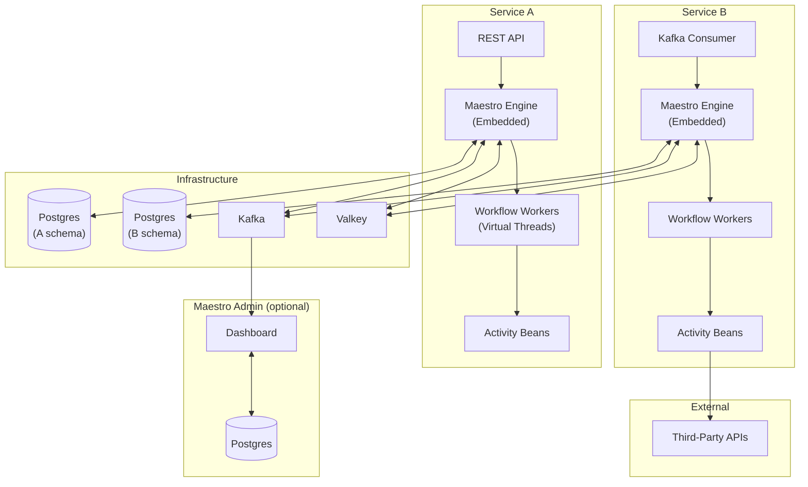

---

## 2. Module Architecture

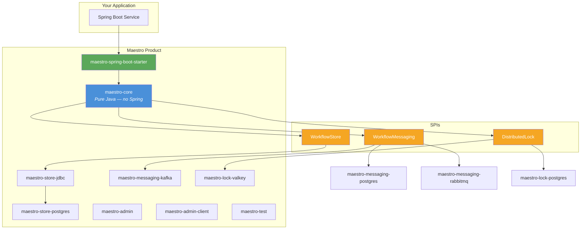

| Module | Responsibility | Spring Dependency? |
|---|---|---|
| `maestro-core` | Execution engine, hybrid memoization, virtual threads, timers, signals, saga, queries. | **No** |
| `maestro-spring-boot-starter` | Auto-configuration, annotation scanning, activity proxy creation, config binding, health indicators. | Yes |
| `maestro-store-jdbc` | Abstract JDBC `WorkflowStore`. | No (JDBC only) |
| `maestro-store-postgres` | Postgres implementation + Flyway 11 migrations. | No |
| `maestro-messaging-kafka` | Spring Kafka 4.x `WorkflowMessaging` implementation. `@MaestroSignalListener` processing. | Yes |
| `maestro-messaging-postgres` | PostgreSQL-based `WorkflowMessaging` + `SignalNotifier`. No external broker required. | No |
| `maestro-messaging-rabbitmq` | RabbitMQ `WorkflowMessaging` via Spring AMQP. | Yes |
| `maestro-lock-valkey` | Lettuce-based `DistributedLock`. | No |
| `maestro-lock-postgres` | PostgreSQL-based `DistributedLock` using advisory locks. | No |
| `maestro-admin` | Standalone dashboard app (Thymeleaf + HTMX, own Postgres schema). | Yes |
| `maestro-admin-client` | Publishes lifecycle events to Kafka. Lightweight. | Minimal |
| `maestro-test` | In-memory SPIs, controllable clock, `TestWorkflowEnvironment`. | No |

> **Operators choose one messaging implementation and one lock implementation for their deployment.** For example, a Postgres-only deployment uses `maestro-messaging-postgres` + `maestro-lock-postgres`, while a full infrastructure deployment uses `maestro-messaging-kafka` + `maestro-lock-valkey`.

---

## 3. Execution Engine — Hybrid Memoization

### 3.1 Normal Execution

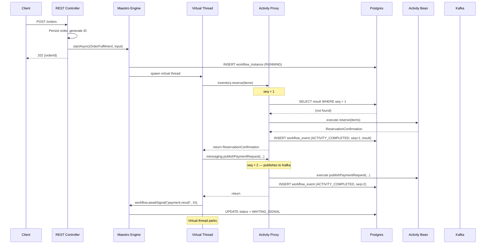

### 3.2 Recovery After Crash

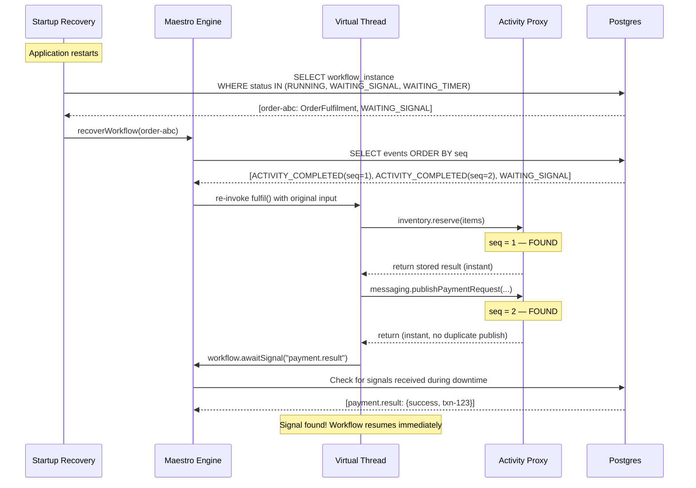

### 3.3 Activity Proxy Detail

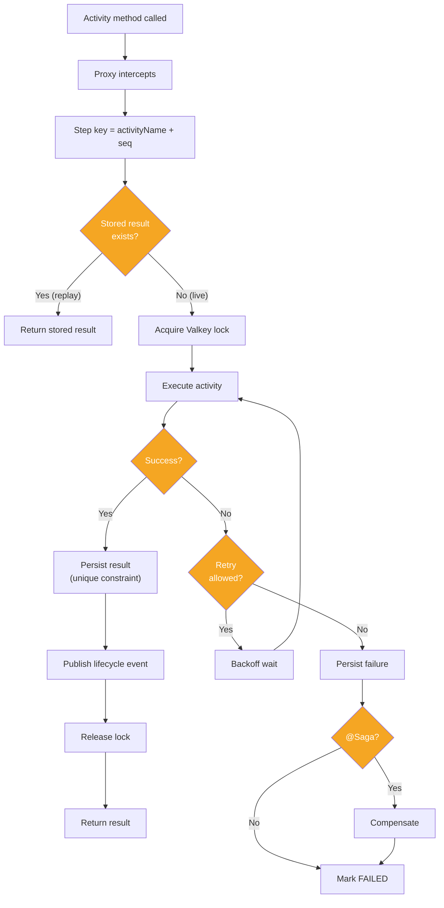

---

## 4. State Management

### 4.1 Schema

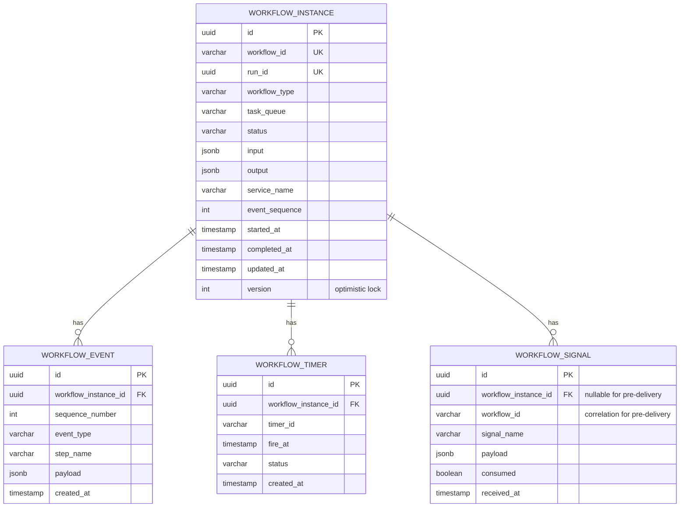

### 4.2 Key Indexes

```sql
CREATE INDEX idx_wf_instance_recoverable
    ON maestro_workflow_instance(status) WHERE status IN ('RUNNING','WAITING_SIGNAL','WAITING_TIMER');

CREATE UNIQUE INDEX idx_wf_event_replay
    ON maestro_workflow_event(workflow_instance_id, sequence_number);

CREATE INDEX idx_wf_timer_due
    ON maestro_workflow_timer(fire_at, status) WHERE status = 'PENDING';

CREATE INDEX idx_wf_signal_pending
    ON maestro_workflow_signal(workflow_id, signal_name, consumed) WHERE consumed = false;

CREATE INDEX idx_wf_signal_orphan
    ON maestro_workflow_signal(workflow_id, consumed) WHERE workflow_instance_id IS NULL AND consumed = false;
```

### 4.3 State Transitions

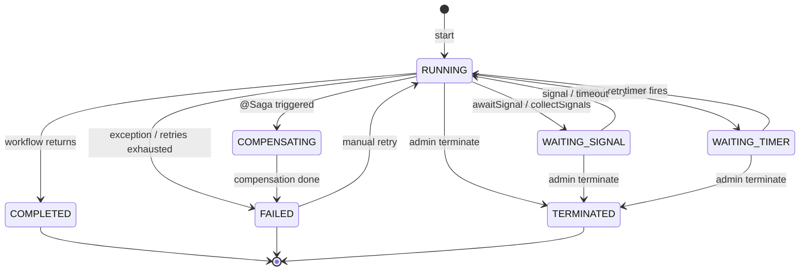

---

## 5. Self-Recovery Pattern

### 5.1 Signal Arrives Before Workflow Reaches Await

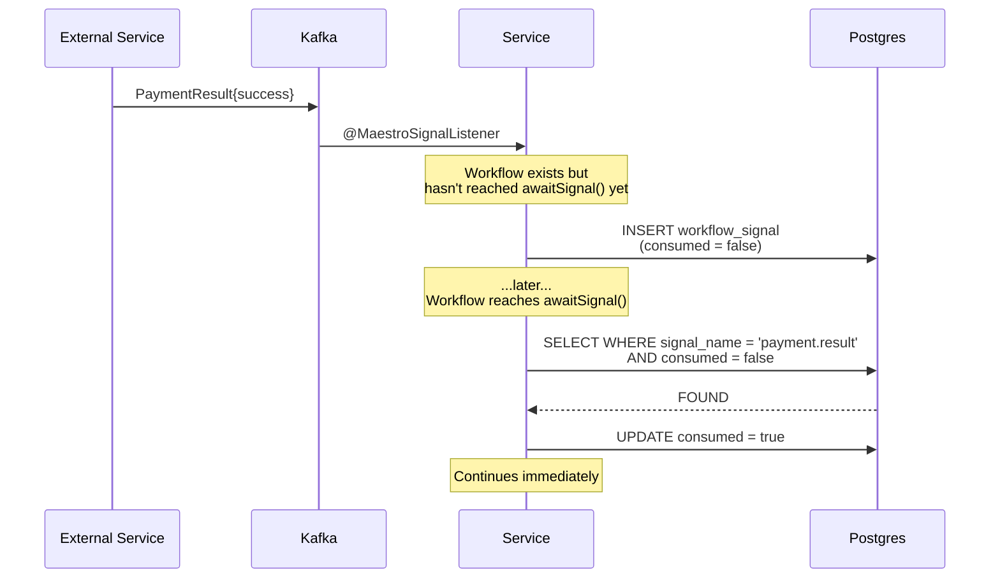

### 5.2 Signal Arrives Before Workflow Starts

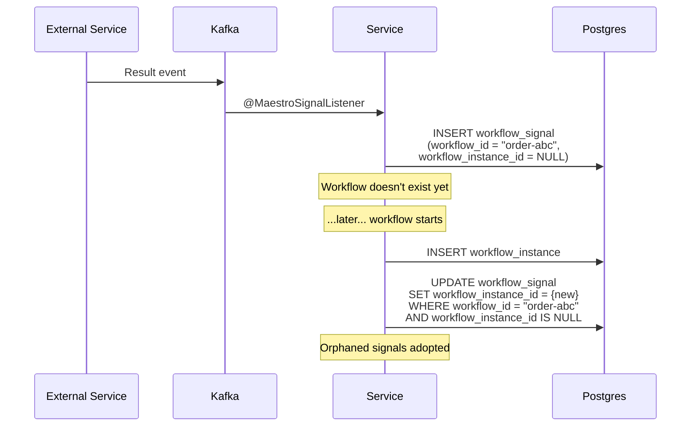

---

## 6. Cross-Service Communication

### Pattern: Orchestration Within, Choreography Between

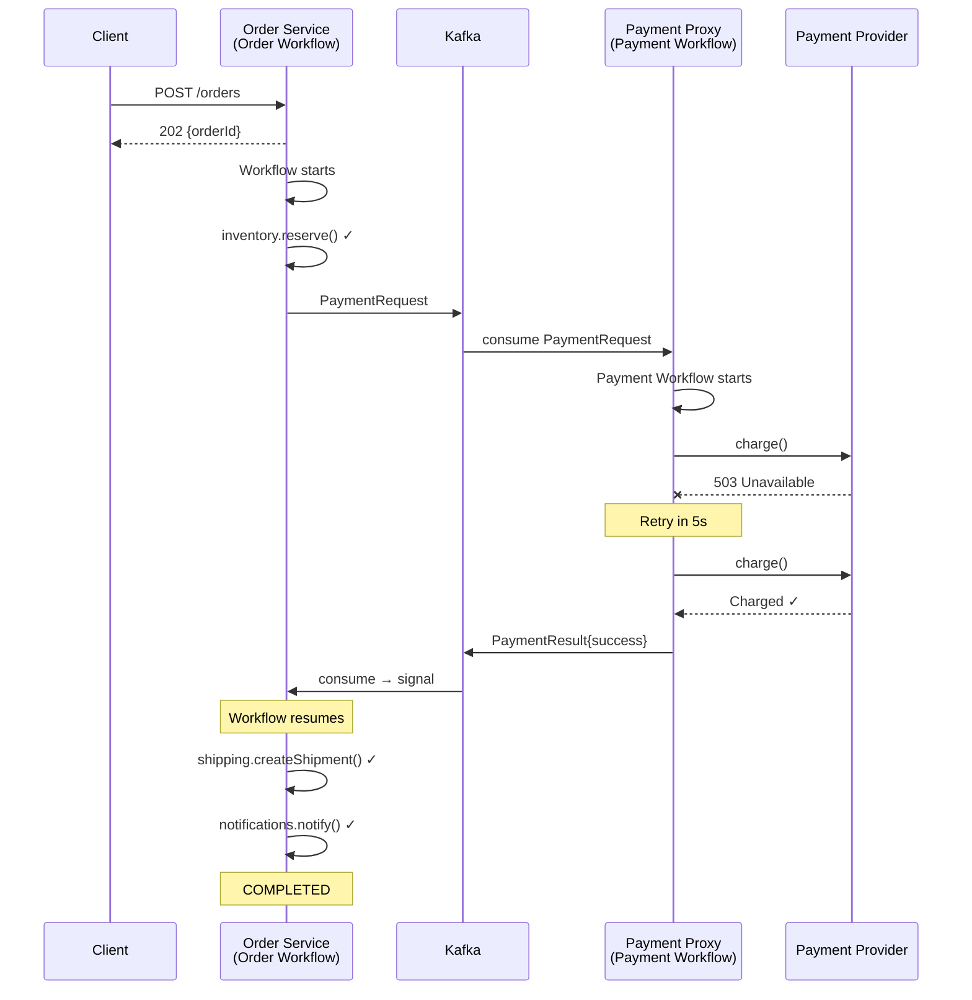

---

## 7. Kafka Topology

All topics are pre-created and declared in `application.yml`.

| Topic | Owner | Key | Purpose |
|---|---|---|---|
| `orders.payment.requests` | Order Service | orderId | Payment commands to proxy |
| `payments.results` | Payment Proxy | orderId | Payment results back |
| `maestro.tasks.{taskQueue}` | Per-service | workflowId | Internal task dispatch |
| `maestro.signals.{service}` | Per-service | workflowId | Inbound signals |
| `maestro.admin.events` | All services | serviceName | Lifecycle events for dashboard |

Consumer group per service: `maestro-{serviceName}`.

---

## 8. Distributed Coordination (Valkey)

| Key Pattern | Purpose | TTL |
|---|---|---|
| `maestro:lock:workflow:{workflowId}` | Workflow instance lock | 30s (auto-renewed) |
| `maestro:dedup:{workflowId}:{seq}` | Activity deduplication | 5m |
| `maestro:leader:timer-poller:{service}` | Timer polling leader election | 15s |
| `maestro:signal:{workflowId}` (pub/sub) | Immediate signal notification | N/A |

**Fallback:** If Valkey is down, locking falls back to Postgres advisory locks, deduplication to unique constraints, and signal notification to poll-based delivery. Postgres is the source of truth; Valkey is a performance optimisation.

---

## 9. Timer Management

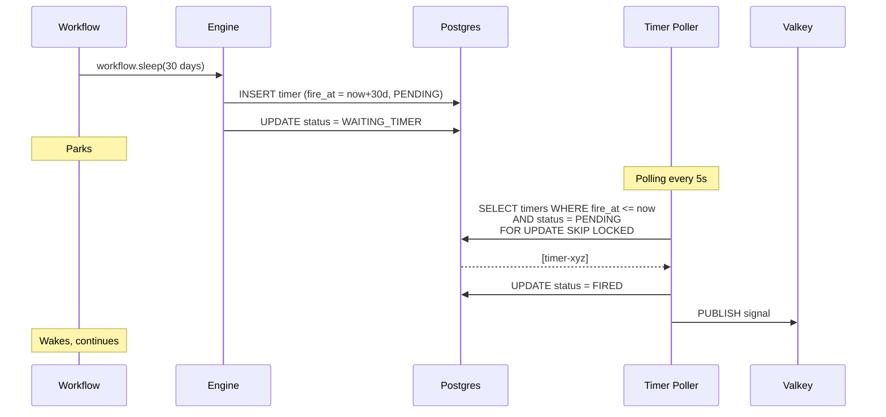

Timer leader election uses Valkey `SET NX EX 15`. One instance per service polls. Lock renewed every 10s.

---

## 10. Saga Compensation

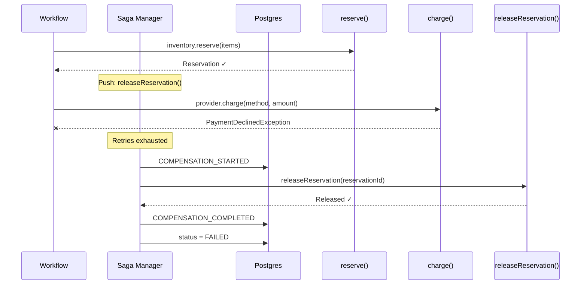

Compensation stack is LIFO — unwound in reverse order of registration.

---

## 11. Parallel Execution

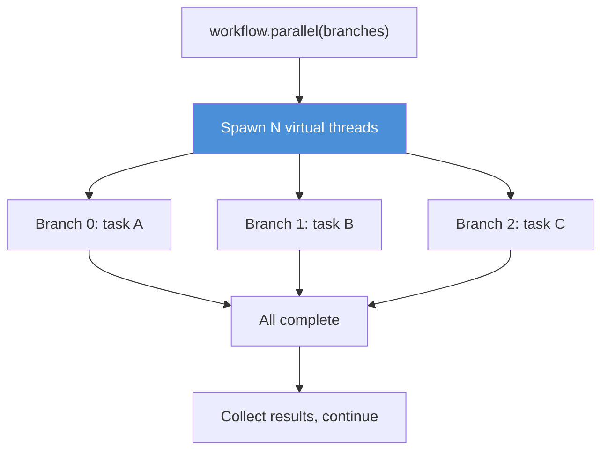

Parallel branches use compound sequence keys: parent `5` → branches `5.0`, `5.1`, `5.2`. Each independently memoized on replay.

---

## 12. Admin Dashboard

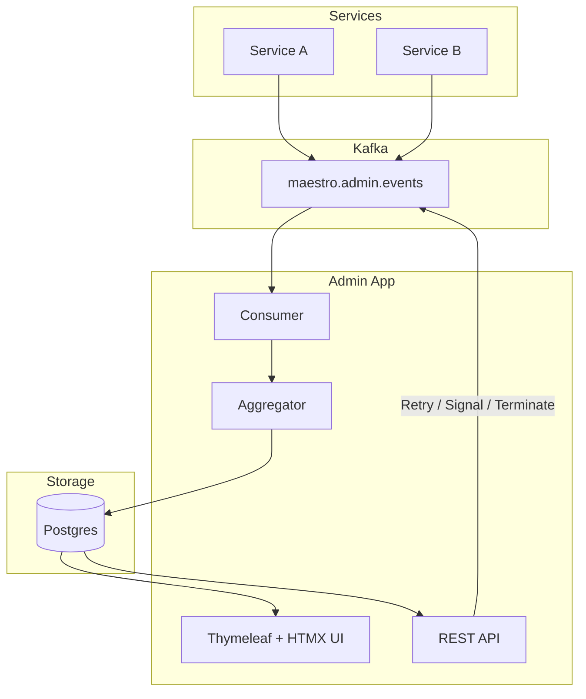

| Page | Content |
|---|---|
| **Overview** | Counts by status per service. Sparklines. Alerts. |
| **Workflow List** | Searchable, filterable by service/type/status/date. |
| **Workflow Detail** | Event timeline. Expandable payloads. Cross-service links. |
| **Failed** | Failure reason, stack trace. One-click retry. |
| **Signals** | Pending, pre-delivered, consumed. |
| **Timers** | Upcoming, overdue. |
| **Actions** | Retry, terminate, send signal, cancel timer. |

---

## 13. Startup and Recovery

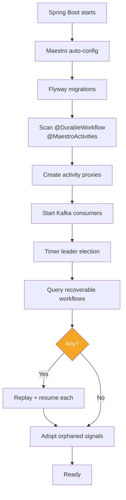

### Graceful Shutdown

SIGTERM → stop accepting new workflows → stop Kafka consumers → wait for in-flight activities (30s default) → release Valkey locks → shutdown.

---

## 14. Failure Modes

| Scenario | Behaviour |
|---|---|
| **JVM crash** | Recovery replays from Postgres. At-least-once activities. |
| **Activity timeout** | Retry with backoff. Exhausted → saga or fail. |
| **External API down** | Activity retries durably (configurable: attempts, backoff, max interval). Service can restart during retries. |
| **Kafka rebalance** | In-progress workflows continue. New tasks reroute. |
| **Postgres lost** | Execution blocks until restored. No activity without persistence. |
| **Valkey down** | Fallback to Postgres locking. Poll-based signals. |
| **Duplicate Kafka delivery** | Valkey dedup + unique constraint. |
| **Signal before workflow** | Stored with null instance. Adopted on start. |
| **Signal before await** | Stored unconsumed. Consumed when await reached. |

### Guarantees

- **Workflow progression:** Exactly-once (at-least-once activities, at-most-once result storage).
- **Activities:** At-least-once. Should be idempotent.
- **Signals:** At-least-once delivery. `consumed` flag prevents double-processing.
- **Timers:** At-least-once. Slight delay possible based on poll interval.

---

## 15. Technology Stack

| Component | Technology |
|---|---|
| Language | Java 21+ |
| Framework | Spring Boot 4.x / Spring Framework 7 |
| Build | Gradle Kotlin DSL (Gradle 9) |
| Database | PostgreSQL 14+ |
| Messaging | Apache Kafka via Spring Kafka 4.x |
| Coordination | Valkey / Redis via Lettuce |
| Serialization | Jackson 3 (`tools.jackson` packages) |
| Schema migration | Flyway 11.x |
| Null safety | JSpecify (aligned with Spring 7) |
| Admin UI | Thymeleaf + HTMX |
| Testing | JUnit 5, Testcontainers 2.0 |
