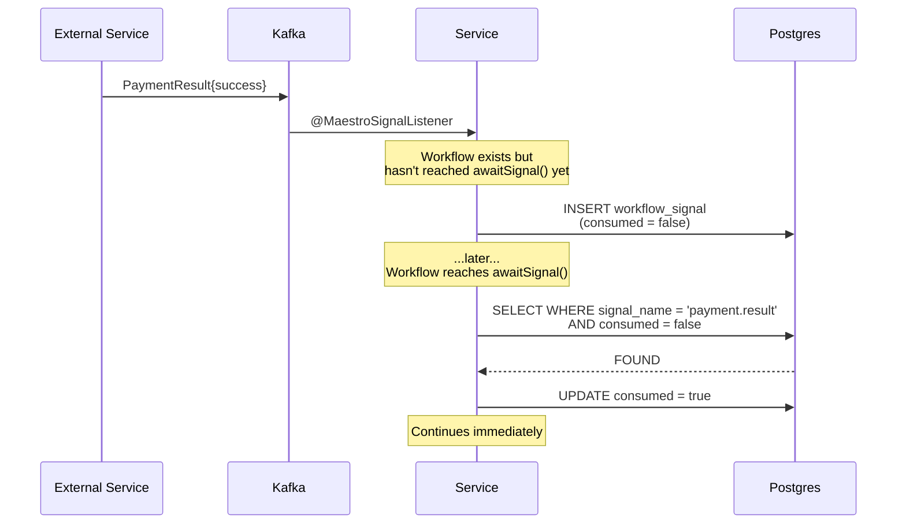
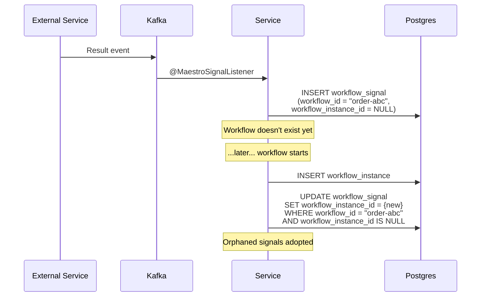
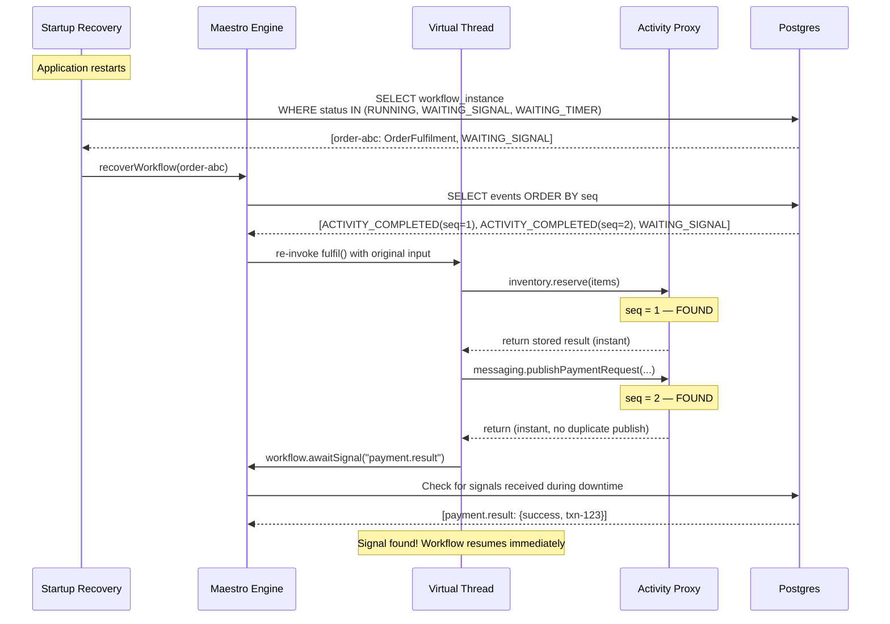
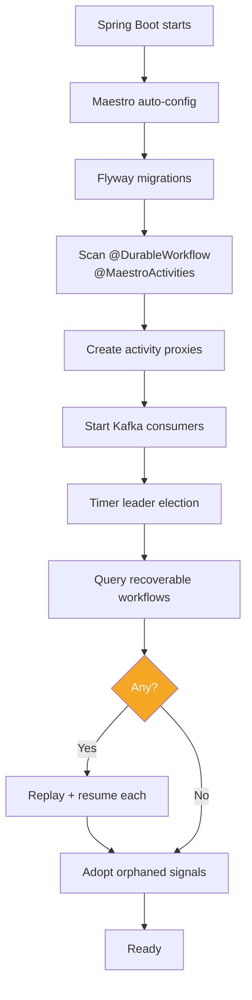

# Self-Recovery

Maestro's self-recovery mechanism guarantees that no signal is ever lost and no workflow is ever abandoned, regardless of crash timing, message ordering, or service downtime.

[← Back to README](../README.md)

---

## Why Self-Recovery Matters

Distributed systems are adversarial to message delivery. The network partitions, services crash mid-execution, and messages arrive in orders that nobody anticipated during design. Consider what happens when:

- A payment gateway sends a callback, but the workflow that needs it hasn't reached the point where it listens for it yet.
- An external system publishes a result, but the workflow doesn't even exist yet because another service hasn't triggered it.
- The JVM crashes while a workflow is parked, waiting for a signal that arrives while the process is down.

Traditional systems lose messages in these scenarios, or require elaborate dead-letter queues, manual retries, and operator intervention. Engineers end up writing defensive code -- polling loops, reconciliation jobs, alert-and-fix runbooks -- that dwarfs the actual business logic.

Maestro eliminates all of this. Every signal is persisted to Postgres the moment it arrives. Every workflow is recoverable from Postgres on restart. The engine handles every timing scenario automatically, so your workflow code stays clean and your operations stay quiet.

---

## The Core Guarantee

**Signals are never lost.** Once a signal is persisted to Postgres, it will be delivered to its target workflow regardless of timing. Three cases cover every possible ordering between signal delivery and workflow execution:

| Case | Scenario | Resolution |
|------|----------|------------|
| 1 | Signal arrives **before** the workflow reaches `awaitSignal()` | Stored immediately, consumed when the workflow catches up |
| 2 | Signal arrives **before** the workflow even starts | Stored with `null` instance ID, adopted when the workflow is created |
| 3 | Signal arrives **while** the service is down | Persisted by Kafka consumer, found during startup recovery |

No special handling is required in your workflow code. You write a straightforward `awaitSignal()` call and Maestro handles the rest.

---

## Case 1: Signal Arrives Before Await

The most common timing scenario. A workflow is running, an external system sends a callback, but the workflow hasn't reached its `awaitSignal()` call yet.



### How it works, step by step

1. **Signal arrives via Kafka.** The `@MaestroSignalListener` on your service receives the payment result event from the external service.

2. **Immediate persistence.** The `SignalManager.deliverSignal()` method persists the signal to the `maestro_workflow_signal` table with `consumed = false`. This happens before any in-memory delivery attempt. Postgres is the source of truth -- if the INSERT succeeds, the signal is safe.

3. **Unpark attempt.** The signal manager tries to unpark the workflow's virtual thread via the `ParkingLot`. Since the workflow hasn't reached `awaitSignal()` yet, nothing is parked. The unpark is a no-op.

4. **Workflow reaches `awaitSignal()`.** Later, the workflow's virtual thread executes `workflow.awaitSignal("payment.result", PaymentResult.class, timeout)`. The `SignalManager.awaitSignal()` method runs through a three-step process:
   - **Replay check:** Look for a `SIGNAL_RECEIVED` event at the current sequence number. During the first (live) execution, this returns empty.
   - **Self-recovery check:** Query `getUnconsumedSignals(workflowId, "payment.result")`. This finds the signal persisted in step 2.
   - **Consume:** Persist a `SIGNAL_RECEIVED` event at the current sequence number, mark the signal as `consumed = true`, and return the payload.

5. **No parking needed.** Because the signal was already waiting in Postgres, the workflow continues immediately. The virtual thread never parks, and no timeout clock starts.

The `idx_wf_signal_pending` partial index on `(workflow_id, signal_name, consumed) WHERE consumed = false` makes the unconsumed signal lookup fast even with millions of rows.

---

## Case 2: Signal Arrives Before Workflow Starts

A subtler scenario. The external system sends a result before the orchestrating service has even started the workflow. This happens in loosely coupled systems where service A fires an event that eventually triggers a workflow in service B, but a third system sends a related signal before service B acts.



### How it works, step by step

1. **Signal arrives for a non-existent workflow.** The `@MaestroSignalListener` receives a signal for workflow ID `"order-abc"`. The `SignalManager.deliverSignal()` method calls `store.getInstance("order-abc")`, which returns empty.

2. **Persisted with `null` instance ID.** The signal is saved to `maestro_workflow_signal` with the business `workflow_id = "order-abc"` but `workflow_instance_id = NULL`. The `WorkflowSignal` record's `workflowInstanceId` field is `@Nullable` specifically for this purpose.

3. **Workflow starts later.** When `WorkflowExecutor.startWorkflow()` creates the workflow instance for `"order-abc"`, it calls `signalManager.adoptOrphanedSignals(workflowId, instanceId)` immediately after persisting the `WorkflowInstance`.

4. **Orphan adoption.** The `adoptOrphanedSignals()` method executes:
   ```sql
   UPDATE maestro_workflow_signal
   SET workflow_instance_id = ?
   WHERE workflow_id = ?
     AND workflow_instance_id IS NULL
   ```
   This links all pre-delivered signals to the new workflow instance.

5. **Normal consumption.** When the workflow reaches `awaitSignal("payment.result", ...)`, the signal is found via the standard unconsumed signal check. From the workflow's perspective, nothing unusual happened.

The `idx_wf_signal_orphan` partial index on `(workflow_id, consumed) WHERE workflow_instance_id IS NULL AND consumed = false` ensures the adoption query is efficient.

---

## Case 3: Signal During Service Downtime

The worst-case scenario. A workflow is parked in `WAITING_SIGNAL` status, and the JVM crashes. While the process is down, a signal arrives on Kafka.

Here, no special mechanism is needed because the existing mechanisms compose naturally:

1. **Before the crash.** The workflow was running, reached `awaitSignal()`, and the `WorkflowInstance` status was updated to `WAITING_SIGNAL` in Postgres. The virtual thread was parked.

2. **During downtime.** The signal arrives on Kafka. If another instance of the service is running, its `@MaestroSignalListener` receives the message and persists it to the `maestro_workflow_signal` table with `consumed = false`. If no instance is running, the message waits in Kafka until a consumer comes back online.

3. **On restart.** The Spring Boot application starts. `StartupRecoveryRunner` (an `ApplicationRunner` ordered at `HIGHEST_PRECEDENCE + 10`) calls `executor.recoverWorkflows()`, which queries:
   ```sql
   SELECT * FROM maestro_workflow_instance
   WHERE status IN ('RUNNING', 'WAITING_SIGNAL', 'WAITING_TIMER', 'COMPENSATING')
   ```

4. **Replay.** The executor re-invokes the workflow method for each recovered instance. The memoization engine replays all completed activities instantly. When the workflow reaches `awaitSignal()`, it checks Postgres for unconsumed signals -- and finds the one that was persisted during downtime.

5. **Immediate continuation.** The workflow resumes from exactly where it left off, with no duplicate side effects and no lost signals.

---

## Crash Recovery: How Memoization Replays

Self-recovery depends on a deeper mechanism: the hybrid memoization engine that makes workflows replayable. When a workflow needs to recover, the engine re-invokes the workflow method from the top and replays all completed steps instantly.



### The replay mechanism in detail

The workflow method is a plain Java method. It calls activities, sleeps, waits for signals, and branches. Each of these operations increments a sequence number on the `WorkflowContext`.

**During replay**, each activity call hits the `ActivityProxy`, which does the following:

1. Compute the current sequence number.
2. Query `store.getEventBySequence(instanceId, seq)`.
3. If a `ACTIVITY_COMPLETED` event exists at that sequence, deserialize the stored result and return it immediately. **No activity code executes. No external calls are made. No side effects occur.**
4. If no event exists, this is the first uncompleted step. Switch from replay mode to live mode and execute the activity normally.

**The key insight:** Because all code between activity calls must be deterministic (no `Math.random()`, `LocalDateTime.now()`, or direct I/O), replaying the same results for the same activity calls produces the same control flow. The workflow takes the same branches, enters the same loops, and reaches the same `awaitSignal()` call -- where it finds the signal that arrived during downtime.

**No duplicate side effects.** An activity that sent an email or charged a credit card during the original execution will not re-execute during replay. The proxy returns the stored result without invoking the activity implementation.

---

## Startup Recovery Flow

When a Maestro-enabled Spring Boot application starts, it goes through a structured initialization sequence that ensures no workflow is left behind.



The `StartupRecoveryRunner` executes as an `ApplicationRunner` ordered at `HIGHEST_PRECEDENCE + 10`, ensuring it runs before any user-defined `ApplicationRunner` beans. This means workflows are recovered before the service starts accepting new traffic.

Recovery queries the `maestro_workflow_instance` table using the `idx_wf_instance_recoverable` partial index, which covers rows with status `RUNNING`, `WAITING_SIGNAL`, `WAITING_TIMER`, or `COMPENSATING`. Only active workflows are considered -- completed and failed workflows are left alone.

---

## Failure Modes and Behaviour

| Scenario | Behaviour |
|---|---|
| JVM crash | Recovery replays from Postgres. At-least-once activities. |
| Activity timeout | Retry with exponential backoff. Exhausted retries trigger saga compensation or workflow failure. |
| External API down | Activity retries durably (configurable `RetryPolicy`). Service can restart during retries. |
| Kafka rebalance | In-progress workflows continue. New tasks reroute to reassigned partitions. |
| Postgres unavailable | Execution blocks until restored. No activity proceeds without persistence. |
| Valkey down | Fallback to Postgres locking and poll-based signal delivery. |
| Duplicate Kafka delivery | Valkey dedup key + unique constraint on `(workflow_instance_id, sequence_number)`. |

The guiding principle: **Postgres is truth, Valkey is optimisation, Kafka is transport.** If Valkey is unavailable, Maestro degrades gracefully to Postgres-based locking and polling. If Kafka rebalances, in-flight workflows are unaffected because their state lives in Postgres. The only hard dependency is Postgres -- and if Postgres is down, the correct behaviour is to wait.

Self-recovery works identically regardless of your choice of messaging backend (Kafka, Postgres, or RabbitMQ) or lock backend (Valkey or Postgres). PostgreSQL is always the authoritative store for workflow state.

---

## Guarantees

Understanding Maestro's guarantees helps you design workflows correctly.

**Workflow progression: Exactly-once.** Each step in a workflow executes exactly once during normal operation. The unique constraint on `(workflow_instance_id, sequence_number)` in the `maestro_workflow_event` table prevents duplicate step recording. If a crash occurs between executing an activity and persisting its result, the activity re-executes on recovery -- which is why activities should be idempotent.

**Activities: At-least-once.** An activity may execute more than once if a crash occurs after execution but before the result is persisted. Design activities to be idempotent: use database constraints, idempotency keys, or conditional operations to ensure repeated execution produces the same outcome.

**Signals: At-least-once delivery.** A signal may be delivered more than once (e.g., Kafka redelivery after a consumer crash). The `consumed` flag in the `maestro_workflow_signal` table prevents double-processing within the workflow. Duplicate signals are persisted but ignored when the workflow has already consumed a matching signal.

**Timers: At-least-once firing.** A timer may fire slightly after its scheduled time, depending on the poll interval (`maestro.timer.poll-interval`, default 5 seconds). Timer fires are also at-least-once -- the timer poller uses `SELECT ... FOR UPDATE SKIP LOCKED` with leader election to prevent duplicate processing, but a crash between firing and marking can cause a re-fire.

---

## Testing Self-Recovery

The `maestro-test` module provides `TestWorkflowEnvironment` with built-in support for testing all three self-recovery cases. The in-memory SPIs behave identically to the production implementations, so recovery tests are fast and deterministic.

### Signal before workflow starts

```java
@Test
void shouldHandleSelfRecovery_signalBeforeWorkflow() {
    // Signal arrives before workflow starts
    testEnv.preDeliverSignal("order-abc", "payment.result",
        new PaymentResult(true, "txn-123"));

    // Workflow starts — picks up pre-delivered signal immediately
    var handle = testEnv.startWorkflow("order-abc",
        OrderFulfilmentWorkflow.class, orderInput);

    var result = handle.getResult(OrderResult.class, Duration.ofSeconds(5));
    assertThat(result.status()).isEqualTo(Status.SUCCESS);
}
```

The `preDeliverSignal()` method stores a signal with a `null` `workflowInstanceId`, exactly as would happen in production when a signal arrives before the workflow exists. When `startWorkflow()` is called, the signal is adopted and available for immediate consumption.

### Signal before await

```java
@Test
void shouldHandleSelfRecovery_signalBeforeAwait() {
    var handle = testEnv.startWorkflow("order-abc",
        OrderFulfilmentWorkflow.class, orderInput);

    // Signal arrives while workflow is still executing earlier activities
    handle.signal("payment.result", new PaymentResult(true, "txn-456"));

    var result = handle.getResult(OrderResult.class, Duration.ofSeconds(5));
    assertThat(result.status()).isEqualTo(Status.SUCCESS);
}
```

For a comprehensive guide to testing workflows, including time control, activity mocking, and parallel branch testing, see the [Testing Guide](testing.md).

---

## See Also

- [Concepts](concepts.md) -- Workflow model, activities, memoization, and determinism rules
- [Cross-Service Patterns](cross-service.md) -- Orchestration within, choreography between services
- [Testing](testing.md) -- Full guide to `TestWorkflowEnvironment` and `maestro-test`
- [Configuration](configuration.md) -- All `maestro.*` properties including recovery and timer settings
